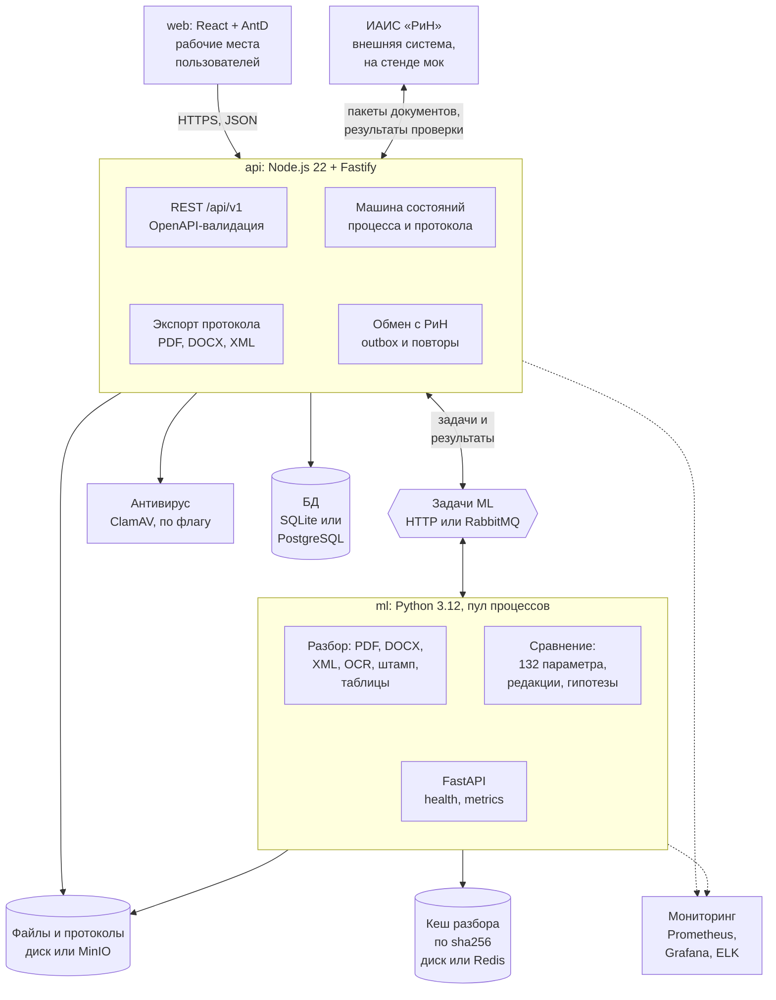
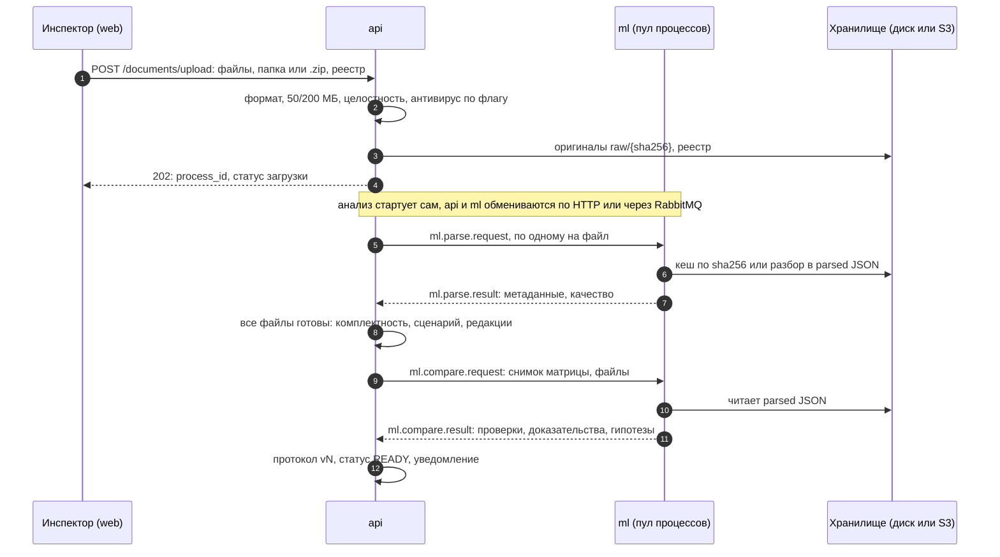
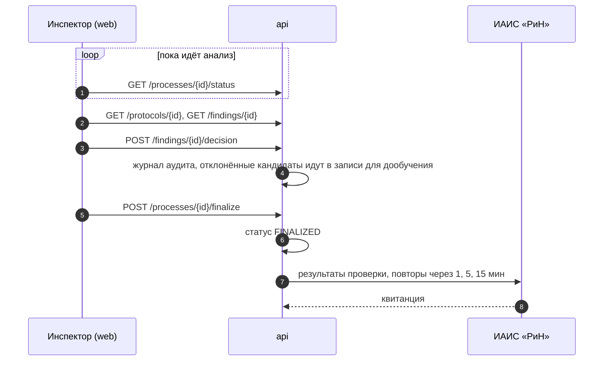
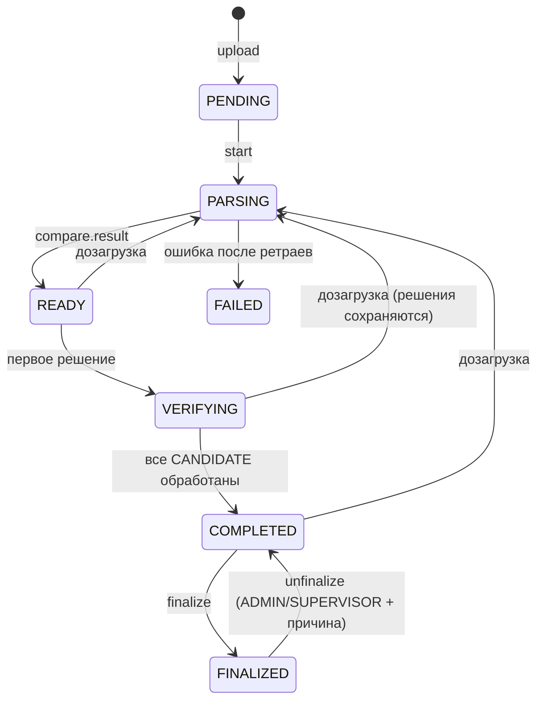

# Архитектура «Продукт»

<!-- pdf:skip -->
> Требования и их ID: [TZ.md](TZ.md). Архитектурные решения записаны в [adr/](adr/README.md).
<!-- /pdf:skip -->

## 1 Общие сведения

### 1.1 Назначение документа

Документ описывает устройство «Продукта»: из каких сервисов состоит система, как они обмениваются
данными, где хранятся данные и как обеспечена безопасность.

### 1.2 Связанные документы

| Документ | Содержание |
|---|---|
| [guides/user-journey.md](guides/user-journey.md) | Работа пользователя по шагам со снимками экранов |
| [domain/models.md](domain/models.md) | Модели и правила конвейера, замеры качества |

### 1.3 Архитектурные принципы

Таблица 1. Архитектурные принципы

| Принцип | Что это значит |
|---|---|
| Сначала контракт, потом код | Все межсервисные контракты лежат в `contracts/`: OpenAPI 3.0 для REST и для сообщений (схемы событий оформлены как `components` OpenAPI-документа). Код подстраивается под контракт, а не наоборот, поэтому все три направления разработки стартовали одновременно, работая с моками. |
| Один сервис, один владелец, одна папка | `services/api` ведёт бэкенд, `services/ml` ведёт ML, `services/web` ведёт фронтенд. Так конфликты при слиянии изменений почти исключены. |
| В базу пишет только api | ML-сервис к базе не подключается: задачи и результаты ходят через HTTP или RabbitMQ, крупные артефакты лежат в файловом хранилище. Схемой базы владеет бэкенд. |
| Модель не выносит нарушений | ML выдаёт только `CANDIDATE`, `NEGATIVE_VERIFIED`, `MISSING_EVIDENCE`, `NOT_APPLICABLE`, `NOT_COMPARABLE`, `CLARIFICATION_REQUIRED`, `SUSPICION`. Статус `CONFIRMED_VIOLATION` появляется только из решения инспектора. |
| Полная трассируемость | Каждый вывод ссылается на `file_id + sha256 + page + bbox`. Каждый протокол фиксирует версии матрицы, модели и набора данных и хеш входного манифеста. |
| ML-конвейер запускается офлайн | `services/ml` работает как CLI без остальных сервисов: так считаются метрики качества на наборах данных. |

## 2 Режимы запуска

По умолчанию система работает на минимуме инфраструктуры: SQLite, файлы на диске и HTTP между api и
ml. Полный контур из ТЗ подключается адаптерами, контракты при этом не меняются.

Таблица 2. Компоненты в двух режимах

| Компонент | Локальный режим (по умолчанию) | Полный контур из ТЗ (опционально) |
|---|---|---|
| БД | SQLite (встроенный `node:sqlite`), файл `var/inspector.sqlite` | PostgreSQL |
| Файлы | Папка `var/storage` (`raw/{sha256}`, `parsed/…`), общая для api и ml | MinIO / S3 |
| Кеш разбора по sha256 | Папка `var/cache` в ml | Redis |
| Обмен api и ml | HTTP: `POST {ML_URL}/v1/jobs`, ответ в `POST /internal/ml/results` | RabbitMQ, те же сообщения |
| ML | `ML_TRANSPORT=stub`: заглушка внутри api; `http`: сервис `services/ml` | То же |
| Языковая модель (Qwen) | Ollama (OpenAI-совместимый API), выключена по умолчанию | vLLM на GPU-сервере |
| Антивирус, мониторинг | Выключены, `/metrics` доступен | ClamAV, Prometheus, Grafana, ELK (`docker-compose.yml`) |

Таблица 3. Способы запуска

| Кто запускает | Команда | Что поднимается |
|---|---|---|
| Разработчик | `./scripts/start-local.sh` | api и web без Docker, ML заглушкой или отдельным процессом |
| Проверяющий | `./start.sh` | Все сервисы в контейнерах одной командой; скрипт сам выбирает образ ML с видеокартой или без |
| Публичный стенд | ВМ в Yandex Cloud | Образы `api`, `ml`, `web` с той же конфигурацией: SQLite и файлы в volume |

> [!NOTE]
> Организаторы подтвердили, что аналоги стека допустимы, например HTTP вместо RabbitMQ.

### 2.1 Как документы попадают в систему

Таблица 4. Пути загрузки

| Путь | Ограничения | Когда использовать |
|---|---|---|
| Интерфейс | До 50 МБ на файл и 200 МБ на пакет | Обычная работа инспектора |
| Серверный импорт папки (`POST /documents/import`, `npm run import:dir`) | Без лимитов | Большие комплекты |

В обоих путях передаётся **реестр файлов** в формате CSV, XLSX или JSON. Он обязателен по «Перечню
ИД» ред. 1.1 и содержит метаданные, `file_id`, sha256, статусы утверждения, связи редакций.

- Поля реестра важнее оценки по имени файла и ML; полнота комплекта считается по реестру.
- Без реестра комплект принимается, но получает статус `CLARIFICATION_REQUIRED`. Реестр можно
  догрузить позже (`POST /processes/{id}/registry`).

> [!NOTE]
> Файлы не перезаписываются. Повторная загрузка того же содержимого создаёт новую запись, в сравнение
> она не идёт; `file_id` закреплён за содержимым.

### 2.2 Матрица параметров

Все 132 параметра M-001…M-132 из Приложения 1 хранятся в базе и включены в проверку. Администратор
может выключить параметр, поменять порог и якоря; каждая правка создаёт новую версию матрицы.

## 3 Состав системы

Сервисы и связи между ними показаны на рисунке 1.



Рисунок 1. Сервисы и связи между ними

Сплошные стрелки на схеме обозначают запросы и данные, пунктир обозначает метрики и логи.

Таблица 5. Сервисы и зоны ответственности

| Сервис и папка | Отвечает за |
|---|---|
| web<br>`services/web` | Вход, выбор объекта со светофором, загрузка и дозагрузка, экран протокола, **рабочее окно верификации** (карточка и синхронные панели ПД / РД / ИД с подсветкой доказательств, не больше 3 действий на нарушение, правка доказательств, массовое подтверждение по параметру), гипотезы, администрирование (параметры, нормативная база, логические правила), аудит, раздел ML (GOLD, модели, отчёт), экспорт |
| api<br>`services/api` | Вход и роли, объекты, загрузка (лимиты, папка и архив `.zip`, реестр, антивирус по флагу `CLAMAV_ENABLED`, файлы на диске или в S3), реестр файлов и редакций, машина состояний, сценарий и комплектность, постановка задач ML, сохранение результатов, **сборка протокола и его версии**, верификация и разделение кандидатов, финализация и её отмена, аудит, экспорт PDF / DOCX / XML, справочники, версии набора GOLD, реестр моделей, интеграция с РиН, уведомления, метрики |
| ml<br>`services/ml` | Разбор, OCR, геометрия страниц, метаданные из штампа, таблицы, CV чертежей, извлечение значений по 132 параметрам, кеш разбора по sha256, пул процессов (`ML_WORKERS`) на разбор и сравнение, выбор редакций, сравнение, гипотезы, метрики и оценка, отчёт для ML-инженеров |
| rin-mock<br>`services/rin-mock` | Мок внешней ИС по `contracts/openapi/rin-external.v1.yaml`: пакеты документов для автозабора, приём результатов с квитанцией и предписанием, проверка токена и подписи, имитация отказов (503, таймаут, порча файла) |
| contracts<br>`contracts/` | OpenAPI, схемы событий, общие перечисления, примеры сообщений |
| infra<br>`infra/`, `docker-compose.yml` | Compose, Prometheus, Grafana, ELK, nginx и TLS, CI |

## 4 Сквозной поток

### 4.1 Загрузка и анализ

Путь комплекта от загрузки до готового протокола показан на рисунке 2. Сообщения между api и ml
идут по HTTP или через RabbitMQ, на схеме транспорт не показан.



Рисунок 2. Загрузка и анализ комплекта

### 4.2 Верификация и финализация



Рисунок 3. Верификация и финализация

### 4.3 Фоновые процессы

Таблица 6. Процессы, которых нет на схемах

| Процесс | Как работает |
|---|---|
| Сверка задач ML | По таймеру api спрашивает ML о своих отправленных задачах (`GET /v1/jobs/{id}`). Потерянную после перезапуска ML задачу отправляет заново, законченную, но не дошедшую, забирает сам. По дедлайну повторяет до `ML_MAX_RETRIES` раз, затем фиксирует ошибку обработки и отправляет уведомление. |
| Отмена финализации | Выполняют администратор и руководитель (`POST /processes/{id}/unfinalize`). Инспектор оставляет запрос на откат с причиной (`POST /processes/{id}/unfinalize-request`). |
| Автозабор из внешней ИС | Раз в `RIN_POLL_INTERVAL_S` (60 с) api забирает новые пакеты (`GET /packages`) и создаёт по ним проверку. |

<!-- pdf:skip -->По шагам, со временем каждого шага и примером на контрольном комплекте: [guides/upload-to-result.md](guides/upload-to-result.md).<!-- /pdf:skip -->

### 4.4 Дозагрузка

1. Инспектор загружает новые файлы с тем же `process_id` (`POST /documents/upload`).
2. Разбираются только новые файлы.
3. api отправляет `ml.compare.request` с `mode = INCREMENTAL` и `changed_file_ids`.
4. ML пересчитывает только параметры, у которых источники совпали по стадии и дисциплине с новыми
   файлами, и перечисляет их в `affected_param_codes`.
5. api собирает новую версию протокола, прошлая остаётся в истории.

> [!NOTE]
> Любая неопределённость (файла нет в запросе, стадия или марка не определилась) трактуется в пользу
> пересчёта: пропущенный параметр молча остался бы в протоколе со старым значением.

При частичном пересчёте движок не отдаёт `upload_status`: судить о полноте по стадиям он вправе, только
когда прошёл по всем параметрам. Поэтому api берёт свою оценку по реестру.

### 4.5 Правки инспектора

Таблица 7. Что может изменить инспектор

| Правка | Как выполняется | Что сохраняется |
|---|---|---|
| Выбор авторитетной редакции | `PATCH /files/{id}` с основанием | Метаданные файла не редактируются |
| Правка доказательств | `POST /findings/{id}/evidence` | Создаётся новая версия группы (`source=INSPECTOR`, автор, причина, ссылка); машинная версия сохраняется, карточка показывает историю правок |

### 4.6 Сохранение решений между версиями протокола

У каждого результата проверки есть стабильный ключ
`finding_key = sha1(object_id | param_code | atomic_rule_key)`. Это «атомарная контрольная точка», по
которой организаторы считают метрики.

- Если в новой версии у результата с тем же ключом совпадает набор доказательств `(file sha256, page)`
  последней машинной версии, решение инспектора и его правки переносятся.
- Если доказательства поменялись, решение сбрасывается в `PENDING` и помечается «доказательства
  обновлены».

## 5 Машины состояний

Статусы процесса проверки и переходы между ними показаны на рисунке 4.



Рисунок 4. Статусы процесса проверки

- Статус протокола в терминах верификации выводится из статуса процесса: `COMPLETED` соответствует
  `VERIFICATION_COMPLETED`, `FINALIZED` соответствует `PROTOCOL_FINALIZED`.
- Статус `FAILED` добавлен как расширение ТЗ.
- Статус синхронизации с РиН (`NOT_SENT → PENDING_SYNC → SYNCED | SYNC_FAILED`) хранится отдельно и
  не влияет на статус протокола.

## 6 Контракты и обмен сообщениями

Таблица 8. Файлы контрактов (`contracts/`)

| Файл | Что описывает | Кто использует |
|---|---|---|
| `openapi/inspector-api.v1.yaml` | Публичный REST (web и внешние ИС) и все доменные схемы: перечисления, bbox, доказательства, результаты проверки, гипотезы, параметры матрицы, протокол | api (валидация и маршруты), web (типы и клиент), rin-mock |
| `events/ml-events.v1.yaml` | Сообщения между api и ml: Envelope, ParseRequest/Result, CompareRequest/Result, ParsedDocument | api (типы TypeScript), ml (pydantic) |
| `dist/*.json` | Самодостаточные сборки обоих файлов, хранятся в git | Генераторы кода во всех сервисах |

### 6.1 Кодогенерация

Сгенерированный код в git не хранится, каждый сервис генерирует его сам.

Таблица 9. Генераторы кода

| Сервис | Генератор | Куда пишет |
|---|---|---|
| web | `openapi-typescript`, клиент `openapi-fetch` | `src/api/schema.d.ts` |
| api | `openapi-typescript` для REST и событий | `src/generated/` |
| ml | `datamodel-code-generator` | `src/inspector_ml/contracts/` |

<!-- pdf:skip -->Точные команды: [contracts.md](contracts.md).<!-- /pdf:skip -->

### 6.2 Транспорт

По умолчанию api и ml обмениваются по HTTP: api отправляет Envelope в `POST {ML_URL}/v1/jobs` с
`reply_to`, ml возвращает результат в `POST /internal/ml/results` (только с localhost или с заголовком
`x-internal-token`). В полном контуре те же сообщения идут через RabbitMQ.

Таблица 10. Топология RabbitMQ (exchange `inspector`, тип `topic`, DLX `inspector.dlx`)

| Routing key | Очередь | Кто публикует → кто потребляет |
|---|---|---|
| `ml.parse.request` | `ml.parse` | api → ml |
| `ml.parse.result` | `api.parse-result` | ml → api |
| `ml.compare.request` | `ml.compare` | api → ml |
| `ml.compare.result` | `api.compare-result` | ml → api |

**Правила обмена**

- Envelope: `{message_id, type, schema_version, correlation_id (= process_id), created_at, payload}`.
- Результат с ошибкой несёт `status: FAILED` и `error{code, message, retryable}`.
- Повторы делает api: не больше 2 повторных публикаций, затем уведомление администратору.
- Обработчики идемпотентны по `message_id`.
- Exchange, очереди и DLX объявляет брокер при старте (`infra/rabbitmq/definitions.json`). Клиенты
  проверяют очереди пассивно или объявляют их с точно такими же аргументами, иначе получат
  `PRECONDITION_FAILED`.

### 6.3 Геометрия доказательств

`bbox = [x0, y0, x1, y1]` задаётся в долях `[0;1]` видимой страницы после применения CropBox и Rotate.

- Начало координат в левом верхнем углу, ось y направлена вниз, как во viewport у pdf.js.
- Polygon задаётся массивом точек `[[x, y], …]` в той же системе.
- Фронтенд умножает координаты на ширину и высоту viewport, дополнительных поворотов не нужно.

## 7 Хранилища

### 7.1 База данных

Базу ведёт только api. Локально это SQLite (миграции `services/api/src/db/migrations/*.sql`, SQL
переносим на PostgreSQL). В базе 16 таблиц из ТЗ и служебные таблицы из таблицы 11. Имена таблиц
записываются в `snake_case`.

Таблица 11. Служебные таблицы

| Таблица | Назначение |
|---|---|
| `users` | Пользователи |
| `processes` | Проверки (`process_id`) |
| `evidence_groups` | Группы доказательств |
| `finding_decisions` | История решений |
| `matrix_versions` | Версии матрицы |
| `page_pairs` | Пары страниц для экрана сравнения |
| `ml_jobs` | Задачи ML, повторы, таймауты |
| `notifications` | Уведомления |
| `integration_outbox` | Синхронизация с РиН |
| `processed_messages` | Идемпотентность обработки сообщений |

### 7.2 Файловое хранилище

Каталог `STORAGE_DIR` (по умолчанию `var/storage`), в полном контуре bucket MinIO.

Таблица 12. Структура файлового хранилища

| Путь | Содержимое |
|---|---|
| `raw/{sha256}` | Оригиналы; один файл на содержимое, повторная загрузка не дублирует данные |
| `parsed/{sha256}/{parser_version}.json` | Результат разбора по схеме `ParsedDocument` |
| `renders/{sha256}/{page}.png` | Растры страниц для OCR и CV |
| `protocols/{process_id}/v{n}-{время финализации}.{pdf,docx,xml}` | Выгрузки финализированного протокола |

### 7.3 Кеш ML

Каталог `CACHE_DIR`, в полном контуре Redis. Ключ `parse:{sha256}:{parser_version}`: один и тот же PDF,
загруженный повторно, не обрабатывается заново. Там же кешируются эмбеддинги якорей.

## 8 Стек и зависимости

Версии библиотек зафиксированы lock-файлами (`package-lock.json`, `uv.lock`).

### 8.1 api (Node.js 22.13 и новее, TypeScript)

Таблица 13. Библиотеки api

| Назначение | Библиотека |
|---|---|
| HTTP | `fastify` 5, `@fastify/multipart`, `@fastify/cors`, `@fastify/jwt` |
| Маршруты и валидация по OpenAPI 3.0 | `fastify-openapi-glue` (от контракта из `contracts/dist`) |
| БД | Встроенный `node:sqlite` и SQL-миграции, без ORM и нативных зависимостей |
| Пароли | `crypto.scrypt` из стандартной библиотеки |
| Проверка файлов | Сигнатуры файлов и `pdf-lib` (целостность и число страниц); ClamAV по протоколу clamd, опционально |
| Контракт сообщений ml | `ajv` и `ajv-formats` |
| Экспорт | `pdfmake` со шрифтом DejaVu Sans, `docx`, XML без зависимостей, выгрузка GOLD<!-- pdf:skip --> ([domain/protocol.md](domain/protocol.md#экспорт))<!-- /pdf:skip --> |
| Логи и метрики | `pino` (JSON), `prom-client` |
| Тесты | `vitest` и `fastify.inject` |
| Кодогенерация | `openapi-typescript` |

### 8.2 ml (Python 3.12, менеджер `uv`)

Стек согласован с менторами<!-- pdf:skip --> ([ADR-0006](adr/0006-ml-stack.md))<!-- /pdf:skip -->.

Таблица 14. Этапы ML-конвейера и технологии

| № | Этап конвейера | Технология |
|---|---|---|
| 1 | Загрузка документов, текстовый слой, геометрия | **PyMuPDF** |
| 2 | Классификатор качества страницы (текст, скан, чертёж; LOW_QUALITY, ABSTAIN) | Собственный код на Python |
| 3 | OCR для страниц без текстового слоя | **PaddleOCR** (кириллица) |
| 4 | Макет и таблицы | **Docling** и собственное извлечение |
| 5 | Структурированное извлечение, когда правил мало | **Qwen** через OpenAI-совместимый API (vLLM, локально Ollama) |
| 6 | Сопоставление сущностей между стадиями | Правила, в перспективе эмбеддинги<!-- pdf:skip --> ([ADR-0003](adr/0003-embedding-model.md))<!-- /pdf:skip --> |
| 7 | Совмещение чертежей | **OpenCV**: ORB, RANSAC, гомография |
| 8 | Визуальное обнаружение различий | **OpenCV**: absdiff, контуры |
| 9 | Движок правил (сравнение, статусы) | Python (`compare/`) |
| 10 | Объяснение для инспектора | **Qwen**, опционально; иначе шаблоны правил |
| 11 | Доказательство | Страница, bbox, источник, sha256 |
| 12 | Решение инспектора | CONFIRM / REJECT / CLARIFY (в api и web) |

Служебные библиотеки: `fastapi`, `uvicorn`, `pydantic` v2, `pydantic-settings`, `httpx`, `structlog`,
`prometheus-client`, `rapidfuzz`, `numpy`, `shapely`, `ruff`, `pytest`, `datamodel-code-generator`.

> [!NOTE]
> Тяжёлые компоненты (PaddleOCR, Docling, sentence-transformers, языковая модель) подключаются как
> необязательные зависимости. Базовый конвейер на PyMuPDF работает без них. Внешние облачные LLM API
> не используются (данные госнадзора, 152-ФЗ), только локальные модели.

### 8.3 web (React, TypeScript)

Таблица 15. Библиотеки web

| Назначение | Библиотека |
|---|---|
| Сборка | `vite`, `typescript` |
| Интерфейс | `antd` v5 (локаль `ru_RU`), `@ant-design/icons` |
| Маршруты и данные | `react-router`, `@tanstack/react-query` (опрос статуса) |
| API | `openapi-fetch` и типы из `openapi-typescript` |
| PDF с подсветкой | `react-pdf` (pdf.js), рамки доказательств поверх страницы |
| Моки до готовности бэкенда | `@stoplight/prism-cli` (мок из OpenAPI), опционально `msw` |
| Тесты | `vitest`, `@testing-library/react`, опционально `playwright` |

### 8.4 Полный контур (`docker-compose.yml`, опционально)

Таблица 16. Компоненты полного контура

| Компонент | Образ | Порт на хосте |
|---|---|---|
| PostgreSQL | `postgres:16` | 5432 |
| Redis | `redis:7` | 6379 |
| RabbitMQ | `rabbitmq:4-management-alpine` (плагин prometheus, топология из `infra/rabbitmq/definitions.json`) | 5672, 15672, 15692 |
| MinIO | `minio/minio` | 9000, 9001 |
| ClamAV | `clamav/clamav` | 3310 |
| api | `services/api/Dockerfile` | 3000 |
| ml (API и воркеры) | `services/ml/Dockerfile` | 8000 |
| web (nginx, HTTPS) | `services/web/Dockerfile` | 8080 / 8443 |
| rin-mock | `services/rin-mock/Dockerfile` | 4020 |
| Prometheus / Grafana | `prom/prometheus`, `grafana/grafana` | 9090 / 3001 |
| ELK (профиль `elk`) | elasticsearch, logstash, kibana | 9200 / 5044 / 5601 |
| Prism mock (профиль `mock`) | `stoplight/prism` | 4010 |

## 9 Безопасность и нефункциональные требования

Таблица 17 показывает, что реализовано в MVP, что настроено частично и что только описано.

Таблица 17. Требования и их реализация

| Требование | Состояние | Как реализовано |
|---|---|---|
| Логин и пароль, роли `INSPECTOR`, `SUPERVISOR`, `ADMIN`, `ML_ENGINEER` | Реализовано | JWT, scrypt, проверка ролей на каждом маршруте, начальные пользователи |
| Аудит всех действий (IP, User-Agent) | Реализовано | Хук Fastify пишет в `audit_log` |
| Антивирус | Реализовано | ClamAV, включается флагом `CLAMAV_ENABLED` |
| TLS 1.3 | Реализовано | nginx; в демо самоподписанный сертификат |
| Шифрование хранимых данных | Частично | SSE в MinIO; для PostgreSQL только описание (LUKS, TDE) |
| УКЭП для РиН | Частично | В демо bearer-токен и подпись тела HMAC-SHA256, в эксплуатации клиентский сертификат |
| Prometheus и Grafana, JSON-логи | Реализовано | Метрики api и ml, дашборды Grafana |
| ELK | Частично | Отдельный профиль compose |
| Оповещения (e-mail, Telegram) | Частично | Правила Prometheus и Alertmanager в конфигурации |
| Резервные копии, RPO и RTO | Частично | Копия SQLite раз в сутки (`scripts/stand-backup.sh`, таймер 03:15). RPO стенда составляет сутки, а не 15 минут из ТЗ; RTO измеряется минутами. Для эксплуатации описаны `pg_dump` и WAL-архив |
| IDS и защита от DDoS | Описание | Ограничение частоты запросов в api |
| Ежедневная проверка хешей | Реализовано | Задача по расписанию в api |

## 10 Структура репозитория

```
.
├── .github/                  # CI
├── README.md
├── Техническое задание.pdf
├── start.sh                  # вся система одной командой (Docker)
├── docker-compose.app.yml    # приложение для сдачи и стенда
├── docker-compose.yml        # ОПЦИОНАЛЬНЫЙ полный контур
├── scripts/start-local.sh    # локальный запуск без Docker одной командой
├── var/                      # локальные данные (БД, файлы, кеш), в .gitignore
├── dataset/                  # локальная копия датасета, в .gitignore
├── .env.example
├── contracts/                # OpenAPI, JSON Schema, примеры
├── data/                     # матрица 132 параметров, мелкие фикстуры; крупные PDF в git не кладём
├── docs/
│   ├── README.md             # оглавление документации
│   ├── TZ.md                 # дайджест ТЗ с ID требований
│   ├── ARCHITECTURE.md       # этот файл
│   ├── SUBMISSION.md         # комплект сдачи
│   ├── glossary.md           # термины
│   ├── contracts.md          # работа с контрактами и кодогенерация
│   ├── domain/               # статусы, модель данных, матрица, протокол, модели
│   ├── services/             # документация сервисов
│   ├── guides/               # запуск, развёртывание, путь пользователя
│   ├── adr/                  # архитектурные решения
│   └── examples/             # примеры выходного JSON
├── infra/                    # docker, стенд, prometheus, grafana, elk, nginx
└── services/
    ├── api/                  # Node.js + Fastify
    ├── ml/                   # Python
    ├── rin-mock/             # мок внешней ИС
    └── web/                  # React
```
