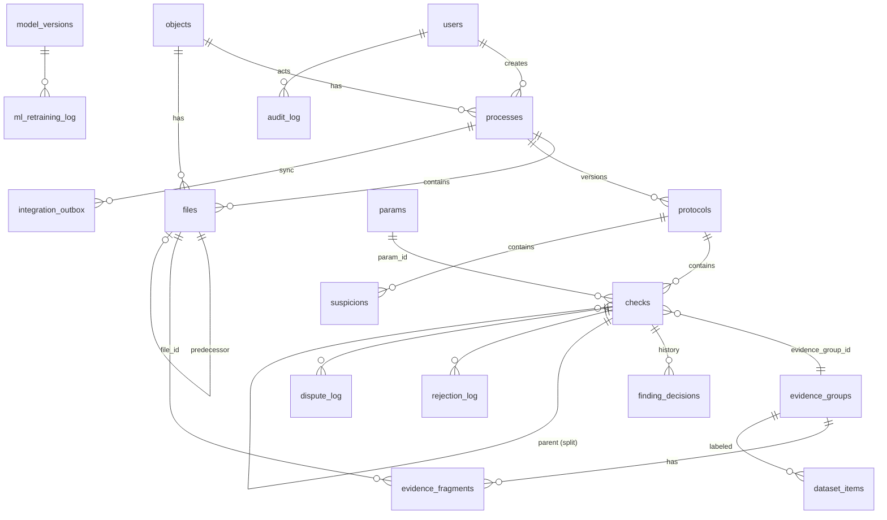

# Модель данных (SQLite, переносимо на PostgreSQL)

> Источник истины — SQL-миграции `services/api/src/db/migrations/*.sql` (SQLite, переносимо на PostgreSQL), этот документ описывает смысл таблиц.
> 16 таблиц пришли из ТЗ (§10), остальные — наши служебные расширения. Имена в `snake_case`.
> Схему БД знает только api. ML работает с данными через сообщения (`contracts/events`).

## ER-диаграмма (упрощённо)

## Таблицы из ТЗ

| Таблица | Назначение | Замечания к реализации |
|---|---|---|
| `params` | Матрица контроля | Поля §8.1 ТЗ. Расширения: `semantic_anchors jsonb`, `enum_values jsonb`, `matrix_version` (в какой версии появился или изменился). `id` — `INT` |
| `checks` | Findings | Плюс поля `protocol_id`, `finding_key`, `rule_key`, `inspector_status`, `delta`, `unit`, `risk_level`, `rationale`, `confidence`, `stages_compared`, `missing_sources`, `approved_change_ref`, `parent_check_id`, `is_split`, `evidence_changed` |
| `objects` | Объекты | `name, address, customer, contractor, permit_number` + `external_id` (object_id разметки / внешнего реестра) |
| `files` | Реестр файлов | Плюс `process_id`, `original_name`, `format`, `size_bytes`, `doc_kind`, `is_authoritative`, `authoritative_basis`, `metadata_source` (MANIFEST / ML / FILENAME), `stage_hint`, `base_stage_hint` (стадия без учёта реестра), `title` (заголовок из реестра), `uploaded_by` (кто загрузил; в API — ещё ФИО), `processing_status`, `quality jsonb`, `parsed_ref`, `parser_version`, `metadata_confidence jsonb`. `file_hash` — SHA-256, `file_path` — ключ в S3 |
| `protocols` | Версии протоколов | Плюс `process_id`, `trigger`, `scenario`, `upload_status`, `snapshot jsonb` (собранный протокол, неизменяемый), `parser_version`. `status` — `ProtocolVerificationStatus` |
| `rejection_log` | Отклонения для дообучения | `violation_id` → `checks.id`, `rejection_reason` — `reason_code`, `ai_verdict`, `suggested_fix`, `retraining_status` |
| `dispute_log` | Спорные случаи | При `CLARIFY` и при несогласии ИИ с отклонением |
| `suspicions` | Гипотезы | Плюс `protocol_id`, `suspicion_key`, `pd_reference`, `rd_reference`, `id_reference`, `review_priority`, `normative_base`, `rule_id`, `evidence_group_id`, `promoted_check_id` |
| `logical_rules` | Логические правила | Плюс `review_priority` |
| `normative_base` | Нормативные документы | `effective_to IS NULL` — действует |
| `ml_retraining_log` | Журнал итераций обучения | Метрики и `per_category_metrics jsonb` |
| `audit_log` | Аудит | Действия пользователей — хук на каждый изменяющий запрос, логин и экспорт (`action` = operationId). Действия системы по обработке документов — оркестратор (`action` = `system.*`: запуск анализа, разбор файла, повтор, сбой, запуск сравнения, новая версия протокола; `user_id` пустой). В API — поле и фильтр `actor_type` (USER / SYSTEM). Хранится ≥ 90 дней, события безопасности ≥ 1 года |
| `monitoring_metrics` | Снимки метрик | Основной канал — Prometheus. Таблица для агрегатов и отчётов, низкий приоритет |
| `evidence_fragments` | Доказательства | `bbox_polygon_norm jsonb` (`{bbox, polygon}`), `role_expected_actual`. Плюс `sha256`, `page`, `sheet`, `document_code`, `revision`, `approval_status`, `normalized_value`, `text_snippet`, `source`, `quality`, `confidence` |
| `dataset_items` | GOLD | Плюс `check_id`, `curation_status`, `curated_by`, `curated_at` |
| `model_versions` | Реестр моделей | PK — `model_version` |

## Служебные таблицы

| Таблица | Назначение |
|---|---|
| `users` | `id, login, password_hash (scrypt), full_name, role, is_active` |
| `processes` | Проверка: `id (= process_id), object_id, status, scenario, upload_status jsonb, current_protocol_id, sync_status, error, created_by, finalized_by, finalized_at` |
| `evidence_groups` | `id, object_id, param_code, rule_key`, **версии**: `version, source (MODEL / INSPECTOR), previous_group_id, created_by, reason, reference`. `checks.evidence_group_id` указывает на текущую версию |
| `expected_documents` | Ожидаемый состав сверх строк реестра (`UploadManifest.expected[]`): `process_id, doc_stage, discipline, document_code, file_name, title` |
| `registries` | Загруженные реестры файлов (действует последний): `process_id, original_name, format (CSV/XLSX/JSON), file_path, sha256, entries jsonb, entries_total, created_by`. Поля реестра у файла: `files.external_file_id, in_registry, registry_key, registry_sha256, sheet_page_range, signature_status, external_predecessor_id, external_successor_id, duplicate_of` — [registry.md](registry.md) |
| `page_pairs` | Пары страниц для экрана сравнения: `left_*`, `right_*`, `match_score`, `homography`, `diff_regions` |
| `ml_jobs` | Задачи ML: тип, файл, попытка, дедлайн, статус |
| `finding_decisions` | История решений: `check_id, action, resulting_status, reason_code, comment, approved_change_ref, user_id, decided_at, protocol_version` |
| `matrix_versions` | `version, params_snapshot jsonb, comment, created_by, created_at`. Новая версия создаётся при любом изменении `params` |
| `dataset_items` | Записи GOLD из решений инспектора: `check_id, evidence_group_id, param_code, gold_label, expert_id, reason_code, curation_status, dataset_version, split, object_group_id`, **`record`** — снимок GOLD-записи на момент выпуска (канонический JSON) |
| `dataset_versions` | Накопительные версии набора: `version, items_count, positives, negatives, new_items, split_hashes jsonb` (SHA-256 строк каждой части выгрузки), `split_counts, objects_by_split, comment, created_by, created_at` |
| `model_versions` | Реестр моделей: `model_version, artifact_hash, dataset_version, split_hashes, matrix_version, metrics_json, threshold_checks, thresholds_passed, approval_status, approved_by, deployed_at, previous_model_version, rollback_to, training_params, code_version, registered_by, decided_at, comment` |
| `ml_retraining_log` | Журнал итераций (REQ-ML-05): регистрация и каждое решение — `action, model_version, dataset_version, split_hashes`, метрики, `comment`, `details` (проверки, артефакт, параметры) |
| `integration_inbox` | Пакеты документов из внешней ИС: `package_id, external_object_id, object_id, process_id, status (APPLIED / DEFERRED / FAILED), files_count, accepted_count, message, error, package jsonb` |
| `notifications` | `user_id / role, type, message, process_id, is_read` |
| `integration_outbox` | `process_id, payload jsonb, sync_status, attempts, next_attempt_at, last_error` |
| `processed_messages` | `message_id` — идемпотентность приёма результатов ML |

## Ключевые инварианты

1. `protocols.snapshot` после создания не меняется. Машинные доказательства тоже не меняются: правки инспектора — новые версии `evidence_groups`. Решения инспектора живут в `checks` и `finding_decisions`, а экспорт собирает актуальное состояние.
2. У одного `process` ровно один текущий протокол (`processes.current_protocol_id`).
3. `checks.finding_status = CONFIRMED_VIOLATION` возможен только при наличии записи в `finding_decisions` с `action=CONFIRM`. Проверяется в сервисе, в идеале ещё и триггером.
4. После `processes.status = FINALIZED` изменения `checks`, `files` и `finding_decisions` запрещены (проверка в сервисе).
5. Файлы не перезаписываются. Повторная загрузка того же содержимого создаёт новую запись с `duplicate_of` (в сравнение идёт первый экземпляр). Внешний `external_file_id` в пределах объекта закреплён за одним sha256 — иначе `FILE_ID_CONFLICT`.
