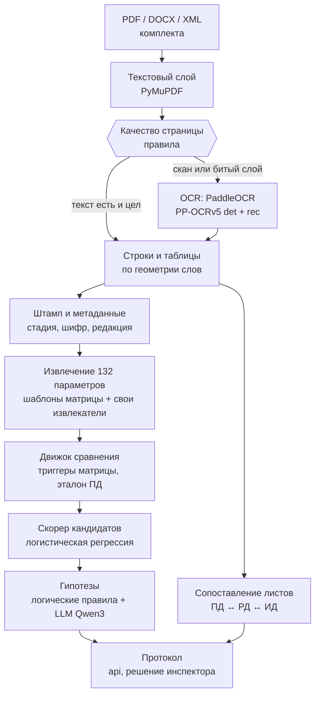

# Модели и как они работают

<!-- pdf:skip -->
> Подробности для разработчиков: [services/ml.md](../services/ml.md), стек:
> [ADR-0006](../adr/0006-ml-stack.md), языковая модель: [ADR-0008](../adr/0008-llm-scope.md).
<!-- /pdf:skip -->

## 1 Общие сведения

### 1.1 Назначение документа

Документ описывает, какие модели и правила стоят в конвейере «Продукта», что делает каждая, на
каких данных она проверена и где проходит граница её полномочий.

### 1.2 Связанные документы

| Документ | Содержание |
|---|---|
| [guides/user-journey.md](../guides/user-journey.md) | Работа пользователя по шагам со снимками экранов |
| [ARCHITECTURE.md](../ARCHITECTURE.md) | Устройство системы: сервисы, потоки данных, хранилища |

## 2 Главный принцип

Надзорный протокол должен быть воспроизводимым и доказуемым. Поэтому обязанности между правилами,
моделями и человеком разделены сознательно (таблица 1).

Таблица 1. Кто за что отвечает

| Кто | Где работает | Почему так |
|---|---|---|
| Детерминированные правила | Извлечение значений по матрице, сравнение по триггерам, статусы | Ответ обязан повторяться от запуска к запуску и объясняться ссылкой на норму |
| Модели | Распознавание сканов, свободный поиск расхождений по смыслу, ранжирование кандидатов по опыту решений инспектора | Здесь правил не хватает |
| Человек | Финальный статус «подтверждённое нарушение» | Его ставит только инспектор; модель предлагает кандидата и прикладывает доказательство: файл, SHA-256, страницу и область листа |

> [!IMPORTANT]
> Все модели локальные, с открытыми весами. Облачные API запрещены: документы госнадзора, 152-ФЗ.

## 3 Конвейер обработки

Путь документа через конвейер показан на рисунке 1.

Рисунок 1. Конвейер обработки документа

> [!NOTE]
> Разбор кешируется по `SHA-256 файла + версия разбора`: один и тот же файл не распознаётся дважды.
> Корпус датасета (423 документа, 29 498 страниц) рассчитан заранее на видеокарте.

## 4 Модели

Таблица 2. Модели в конвейере

| Модель | Задача | Где в конвейере | Веса и лицензия | Состояние |
|---|---|---|---|---|
| PaddleOCR PP-OCRv5_mobile_det | Находит строки текста на скане и чертеже | Страницы без текстового слоя или с битым слоем | Открытые, Apache-2.0 | Работает всегда |
| PaddleOCR eslav_PP-OCRv5_mobile_rec | Распознаёт кириллицу и латиницу в найденных строках | То же | Открытые, Apache-2.0 | Работает всегда |
| Qwen3-8B (через Ollama или vLLM) | Свободный поиск расхождений ПД ↔ РД по смыслу, то есть того, чего нет в матрице | После сравнения, гипотезы `SEMANTIC_DISSONANCE` | Открытые, Apache-2.0 | Написан, выключен по умолчанию |
| Скорер кандидатов (логистическая регрессия) | Вероятность, что инспектор подтвердит кандидата | После движка сравнения | Обучается у нас на решениях инспектора | Код готов, включается одобренной моделью |

### 4.1 Распознавание (OCR)

Таблица 3. Характеристики распознавания

| Характеристика | Значение |
|---|---|
| Подготовка страницы | Рендер в 300 dpi, нарезка на плитки 1600 px с перекрытием 160 px: лист A1–A0 целиком модели не отдать |
| Сшивка строк | С версии разбора `0.5.0` строки, разрезанные границей плитки, сшиваются по общему тексту в полосе перекрытия |
| Выбор страниц | Классификатор качества на правилах: плотность текстового слоя, доля растра, формат листа. Отдельно ловится битый текстовый слой, который выглядит исправным: на корпусе таких страниц 515, они тоже уходят в распознавание |
| Качество | Character Accuracy по формуле ТЗ (1 − Levenshtein / число символов, по странице) на 60 постоянных страницах: 0,81 в версии `0.4.0`, 0,88 в `0.5.0` (текст 0,90, чертежи 0,81) |
| Скорость | 2,4 с на страницу на видеокарте против 34,3 с на процессоре; 500 страниц на RTX 3050 примерно за 10 минут: 513 с в GPU-образе для сдачи (27.09), 595–617 с вместе со сравнением в шести прогонах (26.09) |

> [!IMPORTANT]
> Порог ТЗ по качеству распознавания 0,95 пока не достигнут, это главный резерв качества. По скорости
> на слабой видеокарте запаса нет: норматив тоже 10 минут на 500 страниц.

### 4.2 Свободный поиск языковой моделью

В эталоне организаторов часть нарушений лежит вне матрицы, например «в помещении по ПД отопительный
прибор, в РД его нет». Правилом это не берётся: нужно сравнить смысл двух описаний.

1. Модель получает сопоставленные фрагменты ПД и РД.
2. Модель возвращает гипотезы расхождений с цитатами.
3. Код проверяет ответ (`llm/grounding.py`): цитата обязана найтись в документе, каждое число ответа
   обязано встретиться в переданных фрагментах. Если проверка не прошла, гипотеза отбрасывается.
4. Гипотеза, прошедшая проверку, попадает к инспектору и решается отдельно. Статусы проверок матрицы
   она не меняет.

> [!NOTE]
> Запрет на выдумку держится кодом, а не инструкцией модели. По умолчанию модель выключена: против
> развёрнутой модели на стенде она ещё не прогонялась.

### 4.3 Скорер кандидатов (дообучение)

Таблица 4. Устройство скорера

| Аспект | Как устроено |
|---|---|
| Обучение | На решениях инспектора из выпущенной версии набора GOLD: «подтвердил» даёт положительный пример, «отклонил» даёт отрицательный. Разбиение по объектам, хеши частей набора сверяются до обучения; скрытая тестовая часть не используется |
| Модель | Логистическая регрессия с L2 на numpy. Файл модели в JSON с весами: читаемый, со стабильным хешем, при загрузке не исполняет код |
| Признаки | Раздел параметра, есть ли ключ точки, относительное расхождение, приоритет, пара стадий, утверждённость источников, распознавание |
| Порог | Подобран так, чтобы сохранялось 95 % подтверждённых нарушений: скорер срезает пустых кандидатов, а не спорит с инспектором. Он понижает `CANDIDATE` до `NEGATIVE_VERIFIED` и записывает в обоснование модель, вероятность и порог |
| Публикация | Нужны метрики на валидационной части (precision, recall, F1, FPR по разделам, 95 % интервал), проверки приёмки в api и решение администратора. Api передаёт в запрос сравнения только одобренную модель; если одобренной нет, работают правила |

> [!NOTE]
> Если решений каждого класса меньше 10, модель не обучается: на десятке записей она выглядит
> работающей и ничего не значит.

## 5 Правила, которые делают основную работу

Таблица 5. Правила конвейера

| Компонент | Как устроен | Что показали данные |
|---|---|---|
| Строки и таблицы | Сборка строк и ячеек по геометрии слов, в том числе после распознавания | Экспликации, ТЭП, спецификации читаются и в векторных листах, и в сканах ИД |
| Штамп и метаданные | Правила по основной надписи и титулу: стадия, марка раздела, шифр, редакция, статус утверждения, организация-разработчик; сведения о файле (язык, доля сканов, версия PDF) | Стадия верна у 246 из 259 документов обучающих объектов (было 213) |
| Извлечение 132 параметров | Шаблоны и якоря из матрицы с учётом словоформ; свои извлекатели с ключом точки для M-002 (площадь, экспликации по помещениям), M-003 (расчётная площадь), M-009 (отметка 0,000), M-041 (ширина эвакуационных выходов), M-055 (класс бетона по конструкциям), M-058 (толщина фундаментной плиты) | См. раздел 6 |
| Движок сравнения | Триггер каждого параметра разбирается из текста матрицы: направление (понижение, превышение, любое изменение), порог в % или абсолютный, предел нормы. Эталоном служит ПД: РД и ИД сравниваются с ней по каждой стадии | Вывод объясняется: «повышение B25 → B30, триггер срабатывает только на понижение» |
| Выбор редакции и применимость | Цепочки редакций по реестру и штампу, аннулированные и заменённые не сравниваются; параметр без документов своего раздела получает «несопоставимо» с причиной | Нет выдуманных значений там, где документа нет |
| Сопоставление листов ПД ↔ РД ↔ ИД | Отметки уровня на чертеже с весом редкости (отметка `+13.750` указывает на одно место здания на любой стадии), наименование и номер листа из основной надписи | Пары листов для экрана «Сравнение листов» |
| Логические правила (гипотезы) | Правила вида «если параметр А изменился, проверь Б», их редактирует администратор | Гипотезы показываются рядом с кандидатами, их решает инспектор |

## 6 Качество: как меряем и что получили

Таблица 6. Замеры качества

| Замер | Результат |
|---|---|
| Контрольный комплект 3 (48 PDF, ошибки внесены в 2/3 параметров) | Ожидаемый статус по 132 из 132 параметров, и офлайн, и через стенд |
| Находимость значений на объектах, не использованных при подборе правил (12, 17, 18 и скрытый тестовый «Речников ул. 7-7») | 57 точек «объект × параметр» со значением, 17 из них сразу в ПД и РД; из 16 значений, добавленных последней правкой, 14 верные |
| Находимость по всему кешу разбора (423 документа) | Значение находится у 22 параметров из 132, у 18 из них и в ПД, и в РД |
| OCR, Character Accuracy по странице | 0,81 → 0,88 (версия разбора `0.5.0`), порог ТЗ 0,95 |

Каждый замер воспроизводится командой `inspector-ml eval coverage | extract | ocr | cv` и пишется в
MLflow (эксперимент `inspector-evals`) с версией разбора, матрицей и её хешем, коммитом и полным
отчётом. Там же хранятся версии набора GOLD (`inspector-datasets`) и модели с метриками
(`inspector-models`).

> [!NOTE]
> Контрольный комплект доказывает, что конвейер проходит для всех 132 параметров. На настоящих
> документах значение находится далеко не у всех: строки ТЭП и спецификаций в каждом проекте
> называются по-своему, а параметры АР, КР и ИОС привязаны к конструкциям и элементам. Где значения
> нет, протокол говорит «несопоставимо» с причиной, а не выдумывает.

Следующие шаги: извлекатели с ключом конструкции для КР и АР, обучение скорера на решениях
инспекторов. Сшивка строк OCR уже вошла в версию разбора `0.5.0`.

## 7 Границы полномочий

- Модель не ставит `CONFIRMED_VIOLATION` и не выносит окончательных статусов.
- Протокол, фильтры и хранение живут в api; ML в базу не ходит<!-- pdf:skip --> ([ADR-0002](../adr/0002-ml-without-db.md))<!-- /pdf:skip -->.
- Без языковой модели конвейер работает полностью; её ответ без цитаты из документа отбрасывается.
- Скорер включается только одобренной администратором моделью после проверки метрик.
- Используются только локальные открытые веса; внешние AI-сервисы в продукте не используются.
