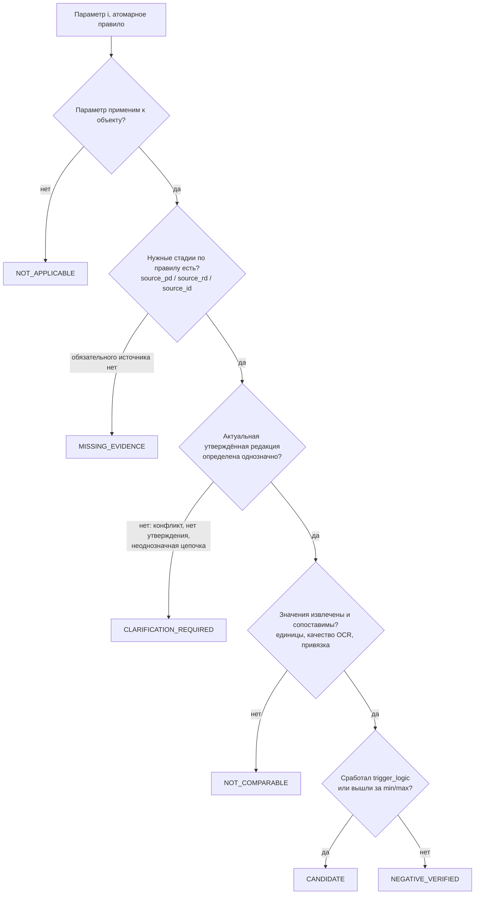

# Статусы и переходы

Статусы — ядро логики ТЗ. Перечисления заданы в `contracts/openapi/inspector-api.v1.yaml` (`components/schemas`), здесь описан их смысл.

## 1. Процесс проверки — `ProcessStatus`

| Статус | Дозагрузка | Верификация | Кто переводит |
|---|---|---|---|
| `PENDING` | ✅ | ❌ | api после первой загрузки |
| `PARSING` | ❌ (409) | ❌ | api по `start`, дозагрузке или смене метаданных |
| `READY` | ✅ | ✅ | api после `ml.compare.result` |
| `VERIFYING` | ✅ | ✅ | api после первого решения инспектора |
| `COMPLETED` | ✅ | ❌ | api, когда не осталось `CANDIDATE` с `inspector_status=PENDING` |
| `FINALIZED` | ❌ | ❌ | инспектор (`finalize`) |
| `FAILED` | ✅ (повторный старт) | ❌ | api, если парсинг или сравнение упали после ретраев (наше расширение) |

Переходы — в диаграмме [ARCHITECTURE.md §5](../ARCHITECTURE.md#5-машины-состояний).

Соответствие статусам протокола из ТЗ (§9.3):

| Процесс | Протокол |
|---|---|
| `READY` / `VERIFYING` | `IN_PROGRESS` |
| `COMPLETED` | `VERIFICATION_COMPLETED` |
| `FINALIZED` | `PROTOCOL_FINALIZED` |

`unfinalize` (только `ADMIN` или `SUPERVISOR`, причина обязательна) переводит `FINALIZED → COMPLETED`.

## 2. Полнота комплекта по стадиям — `StageUploadStatus`

По одному значению на каждую стадию, итого всегда три: `PD_*`, `RD_*`, `ID_*`.

**Правило («Перечень ИД» ред. 1.1):** полнота определяется сравнением с **ожидаемым составом** из реестра файлов, а не числом файлов. Реестр обязателен; без него система **не вправе** объявить комплект полным, и комплект получает статус `CLARIFICATION_REQUIRED`. Подробно — [registry.md](registry.md).

| Значение | Правило |
|---|---|
| `X_MISSING` | Нет ни одного файла стадии X |
| `X_UPLOADED` | Есть реестр (или `expected[]`) с документами стадии X, **все они загружены и распарсены**, и движок сравнения не нашёл недостающих источников для применимых параметров |
| `X_PARTIAL` | Всё остальное: файлы есть, но ожидаемого состава нет (полнота не подтверждена), или по реестру чего-то не хватает, или файл не обработался, или движок нашёл нехватку источников |

- **Итоговый статус** — худший из двух оценок: api (реестр, ошибки обработки) и движка сравнения (источники параметров по `source_pd/rd/id`). При инкрементальном пересчёте движок проходит не по всем параметрам и своей оценки не даёт — остаётся оценка api.
- **Строка реестра считается загруженной**, если файл сопоставлен с ней (по имени или sha256). Прочий ожидаемый документ (`expected[]`) — если есть файл той же стадии с тем же именем, шифром или маркой (именно в таком порядке).
- **Стадия файла:** реестр → подсказка пользователя → папка комплекта («Проектная/Рабочая/Исполнительная документация») → оценка по имени → ML.
- `ProcessInfo.completeness` объясняет инспектору состояние комплекта: итоговый статус (`COMPLETE / MISSING_EVIDENCE / NOT_COMPARABLE / CLARIFICATION_REQUIRED`), есть ли реестр, ожидалось, есть, чего не хватает, и список замечаний `issues[]`. UI показывает это отдельно от кандидатов.

### Полнота доказательств — `CompletenessStatus`

Одно перечисление (схема GOLD, Приложение 1) для комплекта и для каждого finding: `COMPLETE`, `MISSING_EVIDENCE`, `NOT_APPLICABLE`, `NOT_COMPARABLE`, `CLARIFICATION_REQUIRED`. У finding оно живёт отдельно от `finding_status`: например, `CANDIDATE` с `COMPLETE` — полное доказательство, а `NOT_COMPARABLE` с `NOT_COMPARABLE` — лист не сопоставлен. **Без полного доказательства finding при оценке не засчитывается** (лист «МЕТРИКИ»).

### Статус утверждения редакции — `ApprovalStatus`

`DRAFT`, `APPROVED`, `FOR_CONSTRUCTION`, `SUPERSEDED`, `CANCELLED` (из реестра) и `UNKNOWN` (реестра нет, ML не определил). Эталоном служит `APPROVED` или `FOR_CONSTRUCTION`; `SUPERSEDED` и `CANCELLED` хранятся для аудита и в эталонное сравнение не идут.

## 3. Сценарий — `CheckScenario`

Сценарий определяется по набору стадий, в которых есть файлы:

```
если известен пробел (по реестру не хватает документов или файл не обработался) → PARTIALLY_LOADED
иначе по стадиям, где есть файлы:
  {PD, RD, ID} → FULL
  {PD, RD}     → PD_RD_ONLY
  {PD, ID}     → PD_ID_ONLY
  {RD, ID}     → RD_ID_ONLY
  одна стадия  → SINGLE_ONLY
```

Без реестра «частичность» стадии не делает сценарий `PARTIALLY_LOADED`: это означает лишь, что полнота не подтверждена.

## 4. Finding — `FindingStatus` (результат модели)

Порядок проверки параметра строго фиксирован (REQ-CMP-04). **Дерево решений compare-движка:**



Правила:

- **Применимость (узел B).** Признаков объекта во входных данных нет,
  решение наше. Параметр неприменим в двух случаях: матрица не указывает источник ни в
  одной стадии, либо раздел параметра (`section` — ПЗ, КР, АР, ИОС4 …) не представлен ни среди загруженных
  файлов, ни в ожидаемом составе. Второе основание работает **только при наличии реестра**: без него
  отсутствие раздела означает лишь, что полнота не подтверждена — параметр остаётся
  применимым, а нехватка источников уходит в `MISSING_EVIDENCE`. Соответствие «раздел → марки РД»
  берётся **из самой матрицы** (марки в скобках у `source_pd/rd/id`, `applicability.matrix_marks`), а
  таблица `SECTION_MARKS` добавляет синонимы, которых в тексте нет («АС» для «АР»). Второй ручной
  справочник разошёлся бы с матрицей — у нас он разошёлся на все пять подразделов ИОС, и параметры
  электроснабжения молча становились неприменимыми. Незнакомый раздел неприменимым не объявляется.
  Инспектор всегда может решить иначе — `reason_code=PARAMETER_NOT_APPLICABLE`.
- **Сопоставление экземпляров.** Точки ПД ↔ РД ↔ ИД сводятся по `rule_key`: сначала точно по
  нормализованному ключу, затем нестрого. Слова из одной-двух букв сравниваются только точно: «ось А»
  и «ось Б» — разные точки, хотя отличаются одной буквой. Числа должны совпасть полностью — «пом. 1.09» и «пом. 1.10»
  разные точки, хотя строки похожи на 95 %. Слова сравниваются **по форме, а не строкой целиком**:
  «стены в грунте» и «стена в грунте» — одна точка, «вертикальные конструкции подземной части» и
  «…надземной части» — разные. Сравнение строк здесь обманывает: у последней пары 95 % схожести,
  отличие в одну букву из сорока, и классы бетона подземной и надземной части молча сравнились бы
  между собой. При совпавших номерах один ключ может быть подробнее другого («Экспликация помещений
  1-го этажа» и «Экспликация 1-го этажа») — номер уже опознал точку. Внутри одной стадии точки не
  сливаются.
- Если доказательство лежит на листах, которые уже сопоставлены (`page_pairs`), заполняется
  `page_pair_key` — карточка открывает совмещённые листы. Берётся пара, покрывающая обе стороны сравнения.
- Если правилу достаточно двух стадий, сравнение парное. Третья стадия в `stages_compared` не попадает, а при неприменимости получает пометку `NOT_APPLICABLE` в `missing_sources` или обосновании.
- Страница с `ABSTAIN` или `LOW_QUALITY`, из которой пришло значение, даёт `NOT_COMPARABLE` с обоснованием «низкое качество распознавания» и ни в коем случае не `CANDIDATE`.
- `completeness_status` считается отдельно и **всегда** заполнен (перечень схемы GOLD): `COMPLETE` — все требуемые источники есть и сопоставимы; `MISSING_EVIDENCE` — не хватает хотя бы одного; `NOT_COMPARABLE` — источник есть, но не читается или листы не сопоставлены; `CLARIFICATION_REQUIRED` — редакция источника неоднозначна; `NOT_APPLICABLE` — параметр неприменим (с основанием).
- Модель **никогда** не выдаёт `CONFIRMED_VIOLATION` и `SUSPICION` в `checks`. Это гарантировано схемой `CheckResult`.

| Статус | Нарушение? | В GOLD? | Где в протоколе |
|---|---|---|---|
| `CANDIDATE` | нет | нет | таблица (2) |
| `CONFIRMED_VIOLATION` | **да** | позитив | таблица (3) |
| `NEGATIVE_VERIFIED` | нет | негатив | таблица (4) |
| `MISSING_EVIDENCE` | нет | нет | таблица (1) + отдельный перечень |
| `NOT_APPLICABLE` | нет | нет | таблица (1) |
| `NOT_COMPARABLE` | нет | нет | таблица (1) |
| `CLARIFICATION_REQUIRED` | нет | нет | таблица (1); если исходно был кандидатом — ещё и (2) |
| `SUSPICION` | нет | нет | таблица (5) |

## 5. Решение инспектора — `InspectorAction` → `InspectorStatus`

| Действие | Новый `inspector_status` | Новый `finding_status` | Обязательно |
|---|---|---|---|
| `CONFIRM` | `CONFIRMED_VIOLATION` | `CONFIRMED_VIOLATION` | `user_id` и время (сервер), комментарий желателен |
| `REJECT` | `NEGATIVE_VERIFIED` | `NEGATIVE_VERIFIED` | **`reason_code` + `comment`** |
| `CLARIFY` | `CLARIFICATION_REQUIRED` | `CLARIFICATION_REQUIRED` | комментарий желателен |

- Решение можно менять до финализации. Вся история хранится в `finding_decisions`.
- Составной кандидат делится (`split`) на атомарные findings, у каждого своё решение. Исходный получает `is_split=true` и из верификации исключается. Статуса `PARTIALLY_CONFIRMED` **нет**.
- Финализация запрещена, пока есть `finding_status=CANDIDATE` с `inspector_status=PENDING` и `is_split=false`.

`reason_code`:

| Код | Когда |
|---|---|
| `WRONG_REVISION` | выбрана неверная актуальная редакция |
| `APPROVED_CHANGE` | есть согласованное изменение |
| `OCR_ERROR` | ошибка распознавания |
| `LINKING_ERROR` | ошибка привязки документа |
| `EXTRACTION_ERROR` | ошибка извлечения значения |
| `PARAMETER_NOT_APPLICABLE` | параметр неприменим |
| `NO_DISCREPANCY` | расхождения нет |
| `OTHER` | прочее |

## 6. Что уходит в GOLD (REQ-ML-01, REQ-ML-02)

| Решение | Действие системы |
|---|---|
| `REJECT` → `NEGATIVE_VERIFIED` | `dataset_items`: `gold_label=NEGATIVE`, `curation_status=DRAFT`; `rejection_log` |
| `CONFIRM` → `CONFIRMED_VIOLATION` | `dataset_items`: `gold_label=POSITIVE`, `curation_status=DRAFT`. Наружу уходит только после финализации |
| `CLARIFY` | в GOLD не попадает; при споре — запись в `dispute_log` |

В `dataset_version` попадают только записи с `curation_status=APPROVED` **и полным доказательством** (REQ-ML-08: у ожидаемого и фактического источника есть `file_id`, sha256, страница и bbox; полнота `COMPLETE`; метка совпадает с решением инспектора). Разбиение делается по `object_group_id`: часть объекта фиксируется при первом выпуске, новый объект распределяется по sha256(object_id). Выпущенная запись неизменна: курировать её нельзя (`ITEM_RELEASED`), новое решение инспектора после отмены финализации остаётся в `finding_decisions`, а снимок в версии — прежним. Подробности — [services/api.md](../services/api.md), «ML-контур».

## 7. Гипотезы — `Suspicion.inspector_status`

`PENDING → DISMISSED | CLARIFICATION_REQUIRED | PROMOTED`

**Объём свободного поиска: только несоответствия между ПД, РД и ИД.** Соответствие проекта нормам (СП, СНиП) не проверяем. Допустимые методы:

- `SEMANTIC_DISSONANCE` — разные наименования одного и того же в ПД и РД;
- `VISUAL_DIFF` — различия на совмещённых листах;
- `LOGICAL_ANALYSIS` — только правила согласованности между стадиями («элемент есть в ПД → должен быть в РД», «число этажей в ПД = числу планов этажей в РД»);
- `ML_PATTERN` — аномалии значений между стадиями.

`NORMATIVE_ANALYSIS` в перечислении остаётся для совместимости, но не используется.

### Логические правила (`LOGICAL_ANALYSIS`)

Правила заводит администратор через API (`logical_rules`: `condition` и `expected`). Текст приходит из
базы, поэтому исполнять его нельзя: в `suspicion/rules/dsl.py` свой разбор в дерево и вычисление по
нему, без `eval`, `compile` и `ast`. Арифметики в языке нет намеренно.

```
ссылка   := КОД_ПАРАМЕТРА "." ("PD" | "RD" | "ID")        M-002.PD
вызов    := ("exists" | "missing") "(" ссылка ")"
сравнение:= значение (("==" | "!=" | ">" | ">=" | "<" | "<=") значение)?
логика   := "not" | "and" | "or", скобки
```

Два рабочих вида правил: «элемент есть в ПД → должен быть в РД» (`exists(M-055.PD)` →
`exists(M-055.RD)`) и «значение в РД равно значению в ПД» (`exists(M-002.PD) and exists(M-002.RD)` →
`M-002.RD == M-002.PD`).

- Правило считается **по каждой контрольной точке**, точки сводятся между стадиями так же, как в
  движке сравнения (`compare/matching.py`). Параметр без экземпляров даёт одну точку с пустым ключом.
- **Логика трёхзначная.** Нет значения, несравнимые типы, два разных значения одного параметра в одной
  стадии — «неизвестно». Гипотеза появляется, только когда условие достоверно истинно, а ожидание
  достоверно ложно: на неполных данных правило молчит. Расхождение редакций внутри стадии — работа
  движка сравнения (`CLARIFICATION_REQUIRED`), гипотезой его не подменяем.
- `suspicion_key` = sha1(`object_id|rule_id|ключ точки`) — решение инспектора переживает пересчёт.
- Неверно написанное правило пропускается с записью в лог, остальные работают: опечатка в одном
  правиле не должна лишать инспектора протокола. Проверки синтаксиса при сохранении правила в API
  пока нет.
- Параметры, на которые ссылаются правила, пересчитываются **в любом прогоне**, в том числе
  инкрементальном: гипотезы api берёт из ответа целиком и из прошлой версии не переносит.

`PROMOTED` означает, что создан `CANDIDATE` с приложенными доказательствами. Дальше этот кандидат проходит обычную верификацию.

## 8. Синхронизация с РиН — `SyncStatus`

`NOT_SENT → PENDING_SYNC → SYNCED`. Если все ретраи (1, 5, 15 мин) исчерпаны, статус становится `SYNC_FAILED`, уходит уведомление ADMIN и возможен ручной повтор. На статус протокола синхронизация **не влияет**.

## 9. Светофор объекта — `ObjectIndicator`

| Цвет | Условие (по последней проверке объекта) |
|---|---|
| 🔴 `RED` | есть `CONFIRMED_VIOLATION` |
| 🟡 `YELLOW` | есть `CANDIDATE` с `inspector_status=PENDING`, или `CLARIFICATION_REQUIRED`, или `MISSING_EVIDENCE`, или процесс в `PARSING` / `FAILED` |
| 🟢 `GREEN` | остальное |
