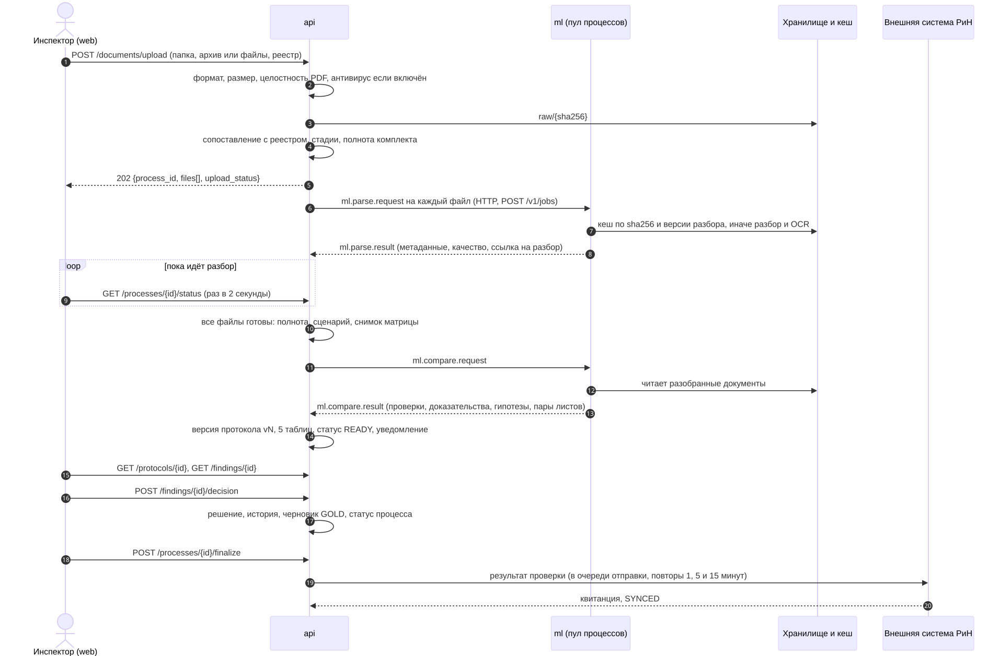
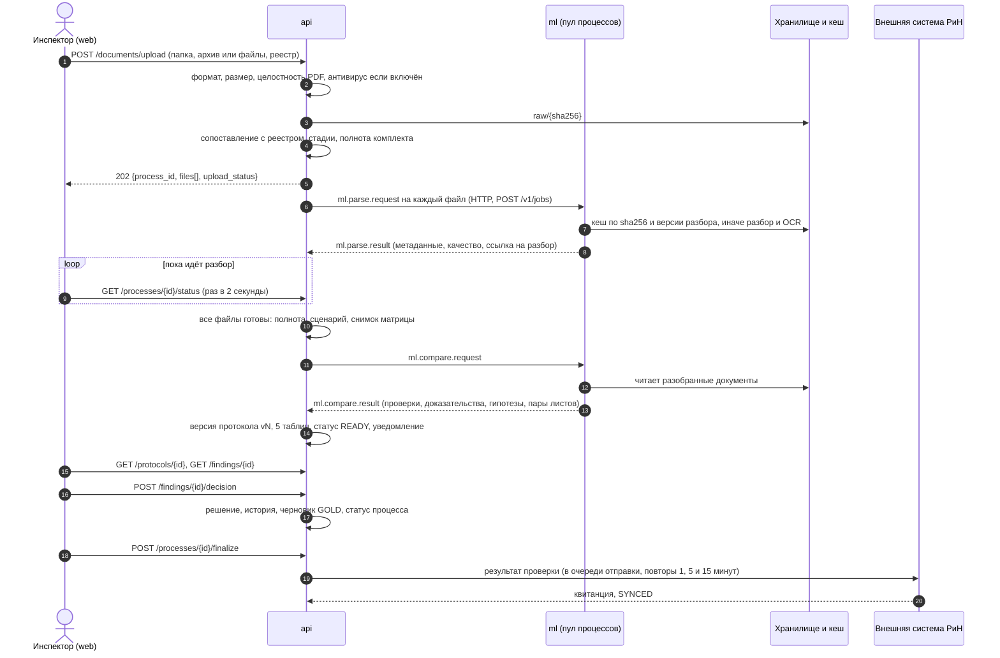

# От загрузки файла до результата

> Сквозной рассказ о том, что происходит с комплектом документов с момента, когда инспектор нажал «Загрузить», и до строки в протоколе, которую он подтвердил и отправил во внешнюю систему. Не справочник по сервисам: устройство каждого из них описано в [docs/services/](../services/), контракты в [docs/contracts.md](../contracts.md), статусы в [docs/domain/statuses.md](../domain/statuses.md).
>
> Документ написан по коду и по живому стенду от 26.09.2026, а не по старым описаниям. Каждый факт можно найти по пути к файлу или эндпоинту рядом с ним. Замеры времени сделаны на стенде 26.09.2026, по каждой строке норматива REQ-PERF, каждый по несколько раз; способ замеров и его границы описаны в разделе «Сколько это занимает».

Кто читает: эксперты и новые разработчики. После чтения вы должны суметь объяснить, что происходит с одним PDF от кнопки «Загрузить» до строки в протоколе.

## Коротко

1. Инспектор загружает комплект: файлы, папку или архив `.zip`, обычно вместе с реестром (перечнем файлов). Сервер `api` проверяет каждый файл, сохраняет его по хешу и сразу запускает анализ.
2. `api` сверяет файлы с реестром, определяет стадию каждого документа (ПД, РД, ИД) и считает полноту комплекта.
3. Сервис `ml` разбирает каждый PDF: страницы, текстовые блоки, распознавание сканов, таблицы, штамп. Результат кешируется по хешу файла.
4. Когда разобраны все файлы, `api` отправляет в `ml` задачу сравнения. Движок берёт актуальные редакции, извлекает значения по матрице из 132 параметров, сравнивает с эталоном (ПД) по триггерам матрицы и возвращает проверки с доказательствами.
5. `api` собирает из результата версию протокола: пять таблиц, доказательства, пары листов. Проверка получает статус «Готов к верификации».
6. Инспектор решает по каждому кандидату: подтвердить нарушение, отклонить с причиной или уточнить. Решения переживают следующие версии протокола.
7. Когда кандидатов без решения не осталось, протокол финализируется, выгружается в PDF, DOCX, XML, JSON или в формате организаторов и уходит во внешнюю систему («РиН»).

Единственный, кто ставит статус «Подтверждённое нарушение», это инспектор. Модель его выдать не может: это гарантирует схема результата `CheckResult`.

## Общая схема

Исходник схемы (mermaid)

Транспорт между `api` и `ml` по умолчанию HTTP: `api` шлёт конверт в `POST {ML_URL}/v1/jobs`, `ml` возвращает результат в `POST /internal/ml/results` ([transport/http.ts](../../services/api/src/modules/transport/http.ts), [app.ts](../../services/api/src/app.ts)). RabbitMQ поддерживается как опция с теми же конвертами, на стенде не используется.

## Сколько это занимает

Все замеры сняты на стенде 26.09.2026 после его пересборки на текущий `main` (движок `compare-0.7.0`, разбор `0.4.0`; на стенде одобрена модель скорера `scorer-2026.09.1`, кандидатов она не понизила). Стенд: один ноутбук, видеокарта RTX 3050 (6 ГБ), четыре процесса ML (`ML_WORKERS=4`), браузер и сервер на одной машине, поэтому сеть в замерах почти ничего не стоит. Время сервера взято из журнала системных событий (`analysis_started`, `file_parsed`, `compare_started`, `protocol_created`), время у пользователя замерено запросами с шагом 20–50 мс. Каждая строка снята несколько раз на сборке `main` от 25.09 (разбор `0.4.0`); с тех пор влиты сшивка строк OCR на стыках плиток (разбор `0.5.0`), свои извлекатели M-003 и M-041 и обновлённый комплект 3, поэтому OCR и цифры комплектов на `0.5.0` не повторялись. в таблице разброс (наименьшее и наибольшее значение); сколько было прогонов, указано в скобках.

| Операция | Цель ТЗ (REQ-PERF) | Замер |
|---|---|---|
| Загрузка 10 файлов по 50 МБ | не дольше 2 минут | 10 файлов по 49 МБ (490 МБ, случайное содержимое, настоящий PDF с вложением) приняты тремя запросами: загрузка 4 файлов (196 МБ, предел пакета) за 3,1 с, две дозагрузки по 4 и 2 файла за 3,0 и 1,2 с, всего 7,4 с. Предел 200 МБ на пакет это отдельное требование ТЗ (REQ-UPL-05), поэтому комплект уходит загрузкой и дозагрузками (REQ-UPL-07). По реальной сети время задаёт канал |
| Разбор PDF с текстовым слоем | 500 страниц не дольше 10 минут | PDF на 500 текстовых страниц: разбор 5,0–5,5 с (около 10 мс на страницу), вместе со сравнением до готового протокола 46–52 с (3 прогона). Комплект из 48 файлов, 90 страниц: разбор 1,2–1,4 с (3 прогона) |
| Распознавание скана (OCR) 100 страниц | не дольше 3 минут | разбор 113–120 с (около 1,15 с на страницу, видеокарта), до протокола 122–128 с (4 прогона); 10 страниц: 12,0–12,9 с (3 прогона), при первом запуске после перезапуска ML до 23 с из-за загрузки моделей на видеокарту |
| Распознавание скана (OCR) 500 страниц | не дольше 10 минут | разбор 562–583 с (1,12–1,17 с на страницу) и 33–36 с на сравнение: **595–617 с, то есть 9 мин 55 с – 10 мин 17 с, в среднем 604 с** (6 прогонов). Цель выполняется на границе: в четырёх прогонах из шести превышена на 1–17 секунд. Три прогона сняты при закрытых браузере и лишних программах (ноутбук от сети, схема питания «Сбалансированная»): 599, 601 и 603 с, то есть открытые программы на результат не влияют. На прошлом замере 24.09 было 559 с (9 мин 19 с), разница около 8 % осталась, запаса на этой видеокарте нет |
| Сравнение 132 параметров | не дольше 2 минут | от `compare_started` до протокола: 0,30–0,34 с на комплекте из 6 файлов (расчёт в ML 0,22–0,24 с), 0,83–0,96 с на комплекте из 48 файлов (расчёт в ML 0,65–0,72 с), 7,4 с после 100 отсканированных страниц, 33–36 с после 500, 41–47 с после 500 текстовых страниц (время растёт с числом страниц) |
| Полный путь от отправки до готового протокола | | 0,46–0,54 с на сервере (6 файлов, холодный прогон, 5 прогонов), 2,1–2,4 с (48 файлов, 3 прогона), 46–52 с (500 текстовых страниц), 122–128 с (скан на 100 страниц), 595–617 с (скан на 500 страниц, 6 прогонов) |
| Генерация протокола (сохранение версии) | не дольше 30 с | входит в предыдущую строку, миллисекунды |
| Дозагрузка одного файла в готовую проверку | не дольше 1 минуты | 0,72–0,89 с до новой версии протокола (3 прогона), пересчитано 47 проверок из 134, расчёт в ML 0,19–0,29 с |
| Решение инспектора | | 16–31 мс на запрос (3 решения в каждом из 3 прогонов); на комплекте 3 60 решений подряд: 22 мс медиана, 29 мс 95-й процентиль, 45 мс наибольшее |
| Финализация и передача в «РиН» | не дольше 30 секунд | 43–46 мс финализация, 0,09–0,22 с до статуса «Передано» (мок «РиН», 3 прогона) |
| Выгрузка протокола | | первый запрос PDF 0,34–0,66 с и DOCX 0,27–0,63 с (файл собирается и сохраняется), повторные запросы из хранилища 28–48 мс; XML, JSON, GOLD и формат организаторов 27–119 мс (3 прогона по 5 запросов) |
| Ответ API, p95 | не более 200 мс | 15 мс (статус проверки), 11 мс (карточка находки), 24 мс (50 находок), 41 мс (список объектов), 54 мс (протокол целиком); 300 последовательных запросов на каждый, протокол комплекта 3 с 86 кандидатами |
| NLP по одному параметру (сравнение значений) | не более 500 мс | около 5 мс на параметр (0,65–0,72 с на 132 параметра в ML, без языковой модели) |
| Обработка чертежа (CV) | не более 30 секунд | **в продукте не реализовано**: совмещение листов и поиск различий ещё не написаны, пары листов строятся по штампу (`cv/pairing.py`, `homography` пуста), подбор пар 210 мс на 6 799 × 838 листов ([ml.md](../services/ml.md)). Замерен прототип на тех же библиотеках (ORB, RANSAC, разность изображений): пара страниц A4 при 150 dpi 0,20 с (наибольшее 0,30 с), при 300 dpi 0,29 с (наибольшее 0,61 с), 10 пар каждый раз, на процессоре. Это оценка запаса, а не замер продукта. Качество компьютерного зрения измерено командой `inspector-ml eval cv` (25.09): стадия по штампу 0,970, «странице нужен OCR» 0,952 по accuracy |

**Холодный прогон и кеш.** Разбор каждого файла кешируется по хешу и версии разбора. Для честного замера комплект прогонялся дважды: холодным (к каждому PDF дописан случайный хвост, хеш новый, `from_cache=false` в журнале) и повторно из кеша. Шесть файлов: около 0,51 с на сервере и холодным, и из кеша (медиана 5 прогонов, разница в пределах разброса); разбор из кеша 2–5 мс на файл вместо 12–25 мс. Для текстовых PDF выигрыш в доли секунды. Настоящая выгода кеша на сканах: страница на видеокарте около секунды, на процессоре около минуты ([ml.md](../services/ml.md), «Производительность»). Поэтому корпус организаторов предрасчитан в кеш. При попадании в кеш метаданные документа всё равно пересчитываются (3 мс на файл).

**Как это собиралось.**

- Комплект из 6 файлов: `scripts/demo-errors-set.py --set 1` (пример ниже). Комплект из 48 файлов: `--set 3`, все 132 параметра матрицы. Комплекты собраны скриптом из актуального `main`. Файлы для холодных прогонов получены добавлением случайных байт-хвостов к копиям.
- Сканы 10, 100 и 500 страниц собраны из PDF без текстового слоя: одна и та же страница отрисована в картинку и вставлена в документ нужное число раз, поэтому весь текст приходит только из распознавания. Значения на всех страницах одинаковые, для времени OCR это неважно. PDF на 500 текстовых страниц сгенерирован отдельно: текст на каждой странице, без изображений.
- Десять файлов по 49 МБ это настоящие PDF с вложением из случайных байт, чтобы содержимое не сжималось. Они проверяют приём и целостность, а не разбор: настоящие 50-мегабайтные проекты разбираются дольше.
- Загрузка и опрос выполнялись запросами к API под сеансом инспектора; время видеокарты и процессора не ограничивалось, другие тяжёлые задачи на ноутбуке не запускались. Прототип совмещения листов (ORB) запускался в контейнере ML отдельным скриптом.

**Чего это не доказывает.** Один ноутбук, один пользователь, без параллельной нагрузки. На проверяющем стенде с другим железом времена будут другими; особенно OCR (на процессоре в десятки раз медленнее). Тяжёлый скан ограничен таймаутом задачи (на стенде `ML_JOB_TIMEOUT_S=1800`, 30 минут): после него файл получает ошибку, а проверка идёт дальше без него (раздел «Когда что-то идёт не так»). Скорость не означает качество: точность распознавания по формуле ТЗ на замере 25.09 равна 0,812 при пороге 0,95 (`inspector-ml eval cv`, [ml.md](../services/ml.md)). Нормативы распознавания выполняются только на видеокарте, на процессоре сканы сверх бюджета `OCR_MAX_PAGES` остаются без текста ([deploy.md](deploy.md)).

## Шаг 1. Загрузка

**Что делает человек.** Открывает страницу «Загрузка» проекта. Перетаскивает файлы в область «Нажмите или перетащите файлы» или нажимает «Выбрать папку», либо кладёт архив `.zip`. Реестр (CSV, XLSX или JSON) загружается вместе с файлами или отдельной кнопкой («Выбрать файл реестра», позже «Заменить файл реестра»). Стадию файла (ПД, РД, ИД) можно выбрать вручную, но для папки и архива это не нужно: стадию берут из названий папок и из реестра.

**Что уходит.** Один запрос `POST /api/v1/documents/upload` (multipart): поля `object_id` или `process_id` (дозагрузка), `auto_start`, `stage_hints`, `manifest`, файлы и поле `registry`. Путь файла внутри папки уходит в имени части формы. Обработчик: [handlers/core.ts](../../services/api/src/handlers/core.ts), `uploadDocuments`.

**Кто обрабатывает.** `api`:

1. [upload.ts](../../services/api/src/modules/upload.ts), `receiveMultipart`: пишет каждый файл во временный, считает SHA-256 и размер. Предел 50 МБ на файл и 200 МБ на пакет (`UPLOAD_MAX_FILE_MB`, `UPLOAD_MAX_BATCH_MB`), у архива предел пакета. До 200 файлов в запросе.
2. [archive.ts](../../services/api/src/modules/archive.ts), `unpackUpload`: архив `.zip` раскрывается на сервере, содержимое становится отдельными файлами с путями «архив/файл». Реестр в корне папки или архива находится сам. Сам архив остаётся карточкой.
3. [upload.ts](../../services/api/src/modules/upload.ts), `checkFile`: формат по содержимому (PDF, DOCX, XML), файл не пустой и не повреждён (для PDF заголовок и маркер конца), антивирус ClamAV, если он включён (`CLAMAV_ENABLED`, по умолчанию выключен).
4. [intake.ts](../../services/api/src/modules/intake.ts), `intakeFiles`: файл, не прошедший проверку, отклоняется с кодом (`UNSUPPORTED_FORMAT`, `CORRUPTED_FILE`, `FILE_TOO_LARGE`, `VIRUS_DETECTED`, `FILE_ID_CONFLICT`), остальные принимаются. Если не принят ни один файл при новой проверке, запрос завершается ошибкой `ALL_FILES_REJECTED`.

**Что сохраняется.**

- Файл в хранилище по ключу `raw/{sha256}`. Один и тот же файл, загруженный дважды, лежит один раз; повторная загрузка того же содержимого в ту же проверку принимается как запись с предупреждением `DUPLICATE_CONTENT` и в сравнение не идёт.
- Строка в таблице `files` со статусом `UPLOADED` и первой оценкой стадии, шифра, раздела и редакции.
- Строка в `processes` (для новой проверки) со статусом `PENDING`.
- Реестр: исходный файл в `registries/{sha256}` и разобранные строки в таблице `registries`; ожидаемый состав в `expected_documents`.

**Что видно в интерфейсе.** Список файлов с плашкой стадии и статусом обработки («Загружен», «В очереди», «Разбирается», «Разобран», «Отклонён», «Не читается»), полоса отправки, для отклонённых файлов причина, предупреждения по реестру. Страница опрашивает статус проверки раз в 2 секунды. На дашборде инспектора три карточки («Всего проектов», «На проверке», «Финализировано»), у каждого проекта одна главная кнопка следующего действия («Загрузить документы», «Продолжить верификацию (N)», «Завершить проверку»), проекты сортируются по названию и дате, а колонку «Проверка» можно отфильтровать («Ждут решения», «Готово к завершению» и другие).

**Сколько занимает.** Ответ `202` приходит после сохранения и проверки всех файлов, но до окончания разбора: у комплекта из шести небольших PDF 0,3–0,4 с, у пакета из четырёх файлов по 49 МБ около 3 с (3,1 и 3,0 с на пакет из 196 МБ), у двух файлов по 49 МБ 1,2 с.

Приоритет метаданных файла: реестр, затем явная подсказка пользователя, затем папка комплекта, затем имя файла. Позже ML уточнит оценку по содержимому, но поля из реестра ML не перетирает.

## Шаг 2. Реестр и полнота комплекта

**Что делает человек.** Ничего: это происходит сразу после приёма. Инспектор видит результат в плашках «ПД: загружена», «РД: частично», «Комплект: полный» и в списке замечаний по реестру.

**Кто обрабатывает.** `api`, функции `matchEntry`, `registryUpdates` в [intake.ts](../../services/api/src/modules/intake.ts) и `computeCompleteness` в [stages.ts](../../services/api/src/modules/stages.ts). Подробные правила: [registry.md](../domain/registry.md).

**Что происходит.**

- Каждый файл сопоставляется со строкой реестра: имя и хеш, потом хеш, потом путь, потом имя. Из строки берутся стадия, раздел, шифр, редакция, статус утверждения, связи «предыдущая и следующая редакция».
- Считается полнота комплекта. Проверяются: реестр загружен, все файлы из реестра есть, хеши совпадают, нет неоднозначных редакций, нет нечитаемых файлов. Итог: `COMPLETE`, `MISSING_EVIDENCE` (не хватает документов), `NOT_COMPARABLE` (часть файлов не читается) или `CLARIFICATION_REQUIRED` (нет реестра или он расходится с файлами).
- По каждой стадии получается статус `..._MISSING`, `..._PARTIAL` или `..._UPLOADED`; из них выводится сценарий проверки (`FULL`, `PD_RD_ONLY`, `PARTIALLY_LOADED` и другие).

**Что сохраняется.** Поля `upload_status` и `scenario` в `processes`, замечания реестра (`issues`), связи редакций в `files`.

**Правило, которое не очевидно.** Реестр обязателен по «Перечню исполнительной документации» ред. 1.1. Без него комплект принимается со статусом полноты `CLARIFICATION_REQUIRED`: файлы разбираются, но полнота не подтверждена.

**Сколько занимает.** Миллисекунды, это выборки из БД.

## Шаг 3. Разбор в ML

**Что делает человек.** Ждёт. После загрузки анализ стартует сам (`auto_start` по умолчанию включён): отдельной кнопки «Запустить» нет, ручной запуск `POST /processes/{id}/start` нужен только для повторного прогона.

**Что уходит.** По одной задаче `ml.parse.request` на каждый новый или упавший файл. Оркестратор [orchestrator.ts](../../services/api/src/modules/orchestrator.ts), `startAnalysis` и `publishParse`: файлы переходят в `QUEUED`, процесс в `PARSING`, задача записывается в таблицу `ml_jobs` (статус `SENT`, срок исполнения `deadline_at`) и уходит в `POST {ML_URL}/v1/jobs`.

**Кто обрабатывает.** Сервис `ml`, задачи выполняются в пуле процессов (`ML_WORKERS`: по умолчанию 2, на стенде 4): [jobs/handlers.py](../../services/ml/src/inspector_ml/jobs/handlers.py), `handle_parse`.

1. Проверяется кеш по паре «SHA-256 файла и версия разбора» (`PARSER_VERSION`, в `main` сейчас `0.5.0`, замеры ниже сняты на `0.4.0`). При попадании разбор не выполняется, отдаётся сохранённый результат (`from_cache: true`), а метаданные документа пересчитываются заново: классификатор мог измениться после предрасчёта, а имя файла у этой загрузки своё.
2. При промахе файл читается из хранилища, пересчитывается хеш и сверяется с заявленным (`SHA256_MISMATCH` останавливает задачу).
3. [ingest/pdf.py](../../services/ml/src/inspector_ml/ingest/pdf.py), `parse_pdf` (PyMuPDF): страницы с геометрией, текстовые блоки с координатами, основная надпись, метаданные документа.
4. Страницы без текстового слоя получают пометку `LOW_QUALITY` и распознаются OCR ([ocr/](../../services/ml/src/inspector_ml/ocr/), PaddleOCR, на видеокарте). Бюджет распознавания ограничивает `OCR_MAX_PAGES`.
5. Метаданные: стадия, шифр, раздел, редакция, статус утверждения, уверенность по каждому полю ([metadata/](../../services/ml/src/inspector_ml/metadata/)). Сведения о документе (контракт 0.20.0): шифр проекта, язык, доля сканов, версия PDF, программы, записавшая и создавшая PDF, признак шифрования ([facts.py](../../services/ml/src/inspector_ml/metadata/facts.py)).
6. Результат кладётся в `parsed/{sha256}/{версия}.json`. Формат: пока разбирается только PDF. DOCX и XML принимаются на загрузке, но не разбираются (задача вернёт `UNSUPPORTED_FORMAT`).

**Что сохраняется.** В хранилище ML: разобранный документ (JSON) и запись в кеше. В БД `api` (пишет только `api`): в `files` статус `PARSED`, метаданные (в том числе сведения о документе, отдельных колонок для них нет), качество (`quality`: страниц всего, с текстовым слоем, распознано OCR, низкого качества), `parsed_ref`, `parser_version`.

**Что видно в интерфейсе.** Статус файла меняется «В очереди» → «Разбирается» → «Разобран» или «Не читается», полоса «разобрано N из M» растёт. У разобранного файла на странице загрузки под названием строка со сведениями («язык: русский, сканов: 100 %, версия: PDF 1.7»), зашифрованный PDF помечен красной плашкой; пустые сведения не показываются. Уведомление приходит, когда готов протокол.

**Сколько занимает.** PDF с текстовым слоем: около 10 мс на страницу (500 страниц за 5,0–5,5 с, файлы комплекта по 15–31 мс). Первый файл после перезапуска ML может разбираться около секунды: это разогрев процессов пула. Скан: 1,12–1,17 с на страницу на видеокарте (100 страниц за 113–120 с, 500 за 562–583 с), около минуты на процессоре, поэтому корпус организаторов предрасчитан в кеш.

## Шаг 4. Сравнение

**Что происходит с момента, когда разобраны все файлы.** После каждого результата разбора `api` считает, сколько файлов ещё в `QUEUED` или `PARSING`. Когда таких нет, вызывается `dispatchCompare` ([orchestrator.ts](../../services/api/src/modules/orchestrator.ts)): пересчитываются полнота и сценарий и в `ml` уходит `ml.compare.request`. В нём снимок матрицы (какие параметры активны, триггеры, пороги), файлы с метаданными и ссылками на разобранное, ожидаемый состав из реестра, режим (`FULL` для первого прогона, `INCREMENTAL` для дозагрузки).

**Кто обрабатывает.** Сервис `ml`: [jobs/handlers.py](../../services/ml/src/inspector_ml/jobs/handlers.py), `handle_compare`, и движок [compare/engine.py](../../services/ml/src/inspector_ml/compare/engine.py). Гипотезы модели добавляет отдельный модуль. Матрицу параметров `api` берёт из своей базы при каждом сравнении; из файла `data/matrix/params.csv` она попадает в базу только при первом запуске, а на работающем стенде обновляется командой `matrix:import` (без неё правки матрицы из `main` на стенд не приходят).

Порядок проверки одного параметра зафиксирован ([statuses.md](../domain/statuses.md), «Finding», REQ-CMP-04):

1. **Применимость.** Параметр неприменим, если матрица не указывает ни одного источника или раздела параметра нет ни среди файлов, ни в ожидаемом составе. Результат `NOT_APPLICABLE`.
2. **Нужные стадии.** Если обязательного источника нет, `MISSING_EVIDENCE`.
3. **Актуальная редакция.** [selection.py](../../services/ml/src/inspector_ml/compare/selection.py) исключает заменённые и аннулированные редакции, учитывает ручной выбор инспектора и цепочки редакций. Неоднозначность даёт `CLARIFICATION_REQUIRED`: вывод о нарушении блокируется, пока инспектор не выберет источник.
4. **Значения.** Значение параметра извлекается из документов актуальных редакций ([extract/](../../services/ml/src/inspector_ml/extract/)): у M-002 (общая площадь) и M-055 (класс бетона) свои разборы с таблицами и координатами, у остальных параметров общий поиск по шаблону и якорям матрицы. Значения сводятся в точки по ключу правила («Общая площадь здания», «Фундаментная плита»). Низкое качество страницы или несопоставимые единицы дают `NOT_COMPARABLE`.
5. **Триггер матрицы.** Эталон это ПД, она прошла экспертизу. Значения РД и ИД сравниваются с ней по триггеру из матрицы ([triggers.py](../../services/ml/src/inspector_ml/compare/triggers.py), [comparators.py](../../services/ml/src/inspector_ml/compare/comparators.py)): направление («понижение класса»), порог отклонения («больше 1 %») или предел значения. Сработал триггер: `CANDIDATE`. Не сработал: `NEGATIVE_VERIFIED`, то есть «нарушения нет». Отличие, которое триггер не описывает, не кандидат.

Дополнительно движок строит **пары листов** ПД и РД (или ИД) по чертежу, чтобы карточка показывала совмещённые страницы, и запускает **логические правила** между значениями. Языковая модель для гипотез по умолчанию выключена (`LLM_ENABLED=false`, [ADR-0008](../adr/0008-llm-scope.md)).

**Скорер кандидатов** (необязательный). `api` кладёт в запрос сравнения текущую одобренную модель (`versions.model_version`, пусто, если одобренной модели нет), а после правил `handle_compare` применяет её ([scorer/apply.py](../../services/ml/src/inspector_ml/scorer/apply.py)): кандидат, которого инспектор почти наверняка отклонит (вероятность подтверждения ниже порога модели), становится `NEGATIVE_VERIFIED`, в обосновании дописывается, кто и почему его понизил. Повысить до подтверждённого нарушения модель не может. Нет модели или файл сломан: работают только правила, проверка не падает.

Почему статус именно такой:

| Статус | Когда |
|---|---|
| `CANDIDATE` | значения извлечены, сопоставимы, триггер матрицы сработал |
| `NEGATIVE_VERIFIED` | значения извлечены и сопоставимы, триггер не сработал; либо кандидата понизил скорер, либо его отклонил инспектор |
| `CLARIFICATION_REQUIRED` | нужен выбор источника: неоднозначная редакция или несколько разных значений в эталоне |
| `MISSING_EVIDENCE` | не хватает документа нужной стадии |
| `NOT_COMPARABLE` | значение не найдено, страница плохо распознана или значения несопоставимы |
| `NOT_APPLICABLE` | параметр к этому комплекту не относится |

**Что сохраняется.** Ничего: движок только считает. Результат возвращается в `api`.

**Что видно в интерфейсе.** Статус проверки «Обработка» (стадия «сравнение» в прогрессе).

**Сколько занимает.** Цель ТЗ: 132 параметра не дольше 2 минут. На примере ниже сравнение заняло 0,32 с (расчёт в ML 0,22 с), на комплекте из 48 файлов 0,8–1,0 с, после 500 страниц скана 33–36 с, после 500 текстовых страниц 41–47 с.

## Шаг 5. Протокол

**Что происходит.** Результат `ml.compare.result` принимает `onCompareResult` в [orchestrator.ts](../../services/api/src/modules/orchestrator.ts), а `persistCompareResult` в одной транзакции создаёт **версию протокола**:

- строка в `protocols` (версия `v1`, `v2`…, статус `IN_PROGRESS`, триггер `INITIAL` или `INCREMENTAL_UPLOAD`, версии матрицы, модели, разбора, хеш входных файлов);
- проверки (`checks`) с группой доказательств: фрагменты с ролью (`EXPECTED` для ПД, `ACTUAL` для РД и ИД), файл, страница, координаты, источник (`TEXT_LAYER` или `OCR`), качество;
- пары листов (`page_pairs`) с областями различий;
- гипотезы (`suspicions`);
- снимок входных файлов и полноты на этот момент, нужный для выгрузки прежних версий.

Прежняя версия остаётся в истории и получает `is_current = 0`.

**Перенос решений между версиями.** У каждой проверки есть устойчивый ключ `finding_key`, хеш от объекта, кода параметра и ключа правила. Если в новой версии у проверки с тем же ключом набор доказательств прежней машинной версии (файл и страница) не изменился, решение инспектора и разбиение на части переносятся. Если доказательства другие, решение сбрасывается в `PENDING` и помечается «доказательства обновлены». При частичном пересчёте (дозагрузка) параметры вне пересчёта копируются из прошлой версии как есть.

Процесс получает статус `READY`, и `api` создаёт уведомление `PROTOCOL_READY` («Протокол готов (версия N): кандидатов X, гипотез Y»). Подробнее про таблицы: [protocol.md](../domain/protocol.md).

**Что видно в интерфейсе.** Страница «Протокол» с пятью таблицами: «Комплектность и сопоставимость» (параметры без сравнения), «Предварительные кандидаты», «Подтверждённые нарушения», «Проверенные отрицательные» (только кандидаты, которые отклонил инспектор; вердикты движка «нарушения нет» без решения инспектора в таблицу не входят, они остаются в данных протокола и в выгрузках), «Гипотезы свободного поиска». У каждой строки карточка доказательства с выделенными областями на страницах ПД, РД и ИД. Колокольчик показывает уведомление, статус проверки «Готов к верификации». Над таблицами блок готовности к завершению (что осталось решить и каких документов не хватает), размер страницы в таблицах выбирается.

**Сколько занимает.** Сохранение версии это одна транзакция с БД: миллисекунды.

## Шаг 6. Центр верификации

**Что делает инспектор.** Открывает «Верификацию», выбирает проект, идёт по списку кандидатов. Для каждого видит значение эталона и фактическое (для нескольких стадий отдельной таблицей «Сравнение по стадиям», а вместо повторяющегося описания блок «Правило срабатывания»: текст триггера из матрицы, полное обоснование под «Подробнее»), обоснование, доказательства на страницах документов. Решение принимается за одно-три действия:

| Действие | Клавиша | Что обязательно |
|---|---|---|
| Подтвердить нарушение | 1 | ничего, комментарий желателен |
| Отклонить | 2, затем причина 1–8 | причина и комментарий (иначе `REASON_REQUIRED`) |
| Уточнить | 3 | ничего |

Причины отклонения: неверная редакция, согласованное изменение, ошибка распознавания, ошибка привязки, ошибка извлечения, параметр неприменим, расхождения нет, прочее. Кандидатов одного параметра можно решить пачкой (`POST /findings/bulk-decision`, только подтвердить или уточнить). Составной кандидат делится на части (`split`), у каждой своё решение. Доказательства можно поправить вручную: рамка на странице, новая версия группы, машинная версия остаётся в истории.

**Что уходит.** `POST /findings/{id}/decision`. Обработчик [verification.ts](../../services/api/src/modules/verification.ts), `decide`. Решение допустимо только у текущей версии протокола и пока проверка не финализирована.

**Что сохраняется.**

- Статус проверки (`CONFIRMED_VIOLATION` или `NEGATIVE_VERIFIED` или `CLARIFICATION_REQUIRED`) и запись в `finding_decisions`: действие, причина, комментарий, кто, когда, версия протокола.
- Для подтверждения и отклонения черновик GOLD (`dataset_items`): подтверждённое нарушение получает метку `POSITIVE`, отклонённое `NEGATIVE`. Отклонение ещё и записывается в `rejection_log` для дообучения. Уточнение в GOLD не попадает, вместо этого пишется `dispute_log`.
- Статус процесса пересчитывается: `READY` → `VERIFYING` при первом решении → `COMPLETED`, когда решены все кандидаты.

**Что видно в интерфейсе.** Счётчики «Подтверждено, Отклонено, Уточнено, Ожидает» и прогресс «N из M проверено», статус проверки «Верификация» и затем «Разобран». Список кандидатов открывается на вкладке «Ожидают решения» и сам переключается на «Все», когда ожидающих нет; справка по клавишам открывается по `Shift + /`, `N` переходит к следующему кандидату без решения, `F` разворачивает панели во весь экран.

**Сколько занимает.** Запрос 16–31 мс (22 мс в среднем на 60 решениях подряд). Время разбора зависит от инспектора.

## Шаг 7. Финализация, выгрузка и передача во внешнюю систему

**Финализация.** Кнопка «Завершить проверку» на странице «Протокол» (`POST /processes/{id}/finalize`). Условие: нет кандидатов без решения (иначе `409 PENDING_CANDIDATES`: «Остались необработанные кандидаты: 3»). Процесс и протокол переходят в `FINALIZED`, решения больше менять нельзя. Отменить финализацию может только администратор или руководитель, с обязательной причиной (`POST /processes/{id}/unfinalize`), тогда процесс возвращается в `COMPLETED`. Инспектор просит откат кнопкой «Попросить откат» с причиной (`POST /processes/{id}/unfinalize-request`, открытый запрос на процесс один, повтор даёт `409`); администратор и руководитель получают уведомление `UNFINALIZE_REQUESTED` и либо откатывают финализацию (запрос закрывается как `DONE`), либо отказывают с причиной (`POST /unfinalize-requests/{id}/reject`).

**Выгрузка** (`GET /protocols/{id}/export?format=…`, [export/](../../services/api/src/modules/export/)):

| Формат | Что это |
|---|---|
| `pdf`, `docx` | читаемый протокол для человека |
| `xml`, `json` | машинное представление протокола |
| `gold` | подтверждённые и отклонённые записи для дообучения |
| `submission` | формат организаторов |

У финализированного протокола файл сохраняется в `protocols/{process_id}/v{n}-{время финализации}.{ext}` и отдаётся из хранилища, после отмены финализации собирается заново.

**Передача во внешнюю систему.** Сразу после финализации `api` кладёт протокол в очередь отправки (`integration_outbox`) со статусом `PENDING_SYNC` и ключом идемпотентности ([integration/outbox.ts](../../services/api/src/modules/integration/outbox.ts)). Фоновый обход отправляет запись в «РиН»; при временной ошибке повторы через 1, 5 и 15 минут (`RIN_RETRY_DELAYS_S=60,300,900`). Успех: `SYNCED` и номер квитанции. Исчерпаны повторы или получена ошибка 4xx: `SYNC_FAILED` и уведомление. Статус передачи хранится отдельно и не влияет на статус протокола.

В обратную сторону работает автозабор: пакеты документов из внешней системы приходят в раздел «Интеграция», из пакета создаётся проверка, дальше всё идёт по тем же шагам.

**Что видно в интерфейсе.** Плашка передачи на странице протокола («Передаётся в …, попытка N», «Передано в …, квитанция …», «Не передано в …» с кнопкой «Отправить повторно»), статус проверки «Финализирован». У администратора на дашборде первым блоком «Запросы на откат финализации»; откат без запроса он делает со страницы протокола.

**Сколько занимает.** Финализация 43–46 мс, до статуса `SYNCED` 0,09–0,22 с на стенде с моком «РиН» (от ответа на финализацию, 3 прогона). Цель ТЗ: отправка не дольше 30 секунд.

## Пример: контрольный комплект

Пример проверен на живом стенде 26.09.2026 на движке `compare-0.7.0`, по пять раз холодным прогоном и повторным с кешем разбора; кандидаты и статусы всех 132 параметров в каждом прогоне одинаковые (времена в разделе «Сколько это занимает»). Комплект собирает скрипт [scripts/demo-errors-set.py](../../scripts/demo-errors-set.py) (`--set 1`): вымышленный объект с заранее внесёнными несоответствиями, поэтому ответ известен заранее. Все файлы с текстовым слоем, распознавание не нужно. Загружался серверным импортом папки (`POST /documents/import`), результат идентичен загрузке той же папки через интерфейс.

### Файлы и куда они пошли

| Файл | Стадия | Как определена стадия | Страниц | Что внутри |
|---|---|---|---:|---|
| `2026-СК2-П-ПЗ.pdf` | ПД | реестр | 2 | пояснительная записка, общая площадь 12 480,6 м² |
| `2026-СК2-П-КР.pdf` | ПД | реестр | 2 | конструктивные решения, классы бетона |
| `2026-СК2-РД-АР.pdf` | РД | реестр | 1 | архитектурные решения, общая площадь 11 905,3 м² |
| `2026-СК2-РД-КЖ.pdf` | РД | реестр | 1 | железобетонные конструкции, классы бетона |
| `АОСР №14 от 14.05.2026.pdf` | ИД | реестр | 1 | акт освидетельствования (фундаментная плита) |
| `АОСР №27 от 18.06.2026.pdf` | ИД | реестр | 1 | акт освидетельствования (плиты перекрытия) |

Плюс `registry.csv` в корне папки: реестр из шести строк со стадией, шифром, редакцией и статусом утверждения (ПД «Утверждена», РД «В производство работ»). На выходе шага 1: `upload_status = ПД, РД, ИД загружены`, сценарий `FULL`, все шесть файлов с источником метаданных `MANIFEST` (то есть по реестру). Шаг 3 разобрал все страницы по текстовому слою (`pages_ocr: 0`).

### Откуда взялся каждый из трёх кандидатов

Для каждого нарушения показано, что нашёл разбор в каждом файле и как сработал триггер матрицы (значения из карточки доказательства).

**M-002, «Общая площадь здания».**

| Стадия | Файл, страница | Значение |
|---|---|---|
| ПД (эталон) | `2026-СК2-П-ПЗ.pdf`, стр. 2 | 12 480,6 м² |
| РД | `2026-СК2-РД-АР.pdf`, стр. 1 | 11 905,3 м² |

Отклонение −575,3 (−4,61 %) больше порога 1 %. Триггер матрицы: «Дельта общей площади между ПД и РД (или ИД) больше 1 %». Статус `CANDIDATE`, приоритет высокий. Сравнивалась одна стадия (РД), поэтому таблицы «Сравнение по стадиям» в карточке нет: вся картина уже в блоке «Ожидается и фактически».

**M-055, «Фундаментная плита» (класс бетона).**

| Стадия | Файл, страница | Значение |
|---|---|---|
| ПД (эталон) | `2026-СК2-П-КР.pdf`, стр. 2 | B30 |
| РД | `2026-СК2-РД-КЖ.pdf`, стр. 1 | B25 |
| ИД | `АОСР №14 от 14.05.2026.pdf`, стр. 1 | B25 |

Понижение на 2 ступени. Триггер: «Понижение класса бетона несущих элементов в РД или ИД». `CANDIDATE`. В карточке блок «Сравнение по стадиям» показывает обе стадии: РД (B25, «Нарушение») и ИД (B25, «Нарушение»).

**M-055, «Плиты перекрытия».**

| Стадия | Файл, страница | Значение |
|---|---|---|
| ПД (эталон) | `2026-СК2-П-КР.pdf`, стр. 2 | B25 |
| РД | `2026-СК2-РД-КЖ.pdf`, стр. 1 | B30 |
| ИД | `АОСР №27 от 18.06.2026.pdf`, стр. 1 | B22,5 |

РД выше эталона: это повышение класса, триггер на него не реагирует. ИД ниже эталона на одну ступень: триггер сработал. Значение, давшее вывод, попадает в карточку как «фактическое» (B22,5), значение РД остаётся в доказательствах. `CANDIDATE`. В блоке «Сравнение по стадиям»: РД (B30, «В допуске», «Повышение: B25 → B30, триггер срабатывает только на понижение») и ИД (B22,5, «Нарушение», «Понижение: B25 → B22.5»). Так инспектор сразу видит, что РД в порядке, а нарушение только в акте.

Ещё четыре проверки дали `NEGATIVE_VERIFIED`, то есть «нарушения нет»: M-055 «Вертикальные конструкции» (B35 в ПД и в РД), M-001 (1 420,5 м² в ПД и в РД), M-004 (48 320,0 м³ в ПД и в РД) и M-007 (10 этажей в ПД и в РД). В протоколе это не строки таблицы находок: таблица «Проверенные отрицательные» показывает только отклонения инспектора, а эти проверки остаются в данных протокола и в выгрузках.

### Что стало со всеми 132 параметрами

| Статус | Сколько |
|---|---:|
| `CANDIDATE` | 3 |
| `NEGATIVE_VERIFIED` | 4 |
| `NOT_APPLICABLE` | 27 |
| `NOT_COMPARABLE` | 100 |
| `CLARIFICATION_REQUIRED`, `MISSING_EVIDENCE` | 0 |

Откуда взялись `NOT_COMPARABLE` и `NOT_APPLICABLE` (проверено по обоснованиям в протоколе):

- 98 из 100 несопоставимых: «Значение параметра не найдено в документах». У большинства параметров матрицы нет своего разбора, общий поиск по шаблону в этом небольшом комплекте ничего не нашёл. Это не ошибка загрузки, а текущий охват извлечения.
- 2 из 100: «Нет фактического значения (РД, ИД) для сравнения с эталоном»: значение есть только в ПД.
- Все 27 неприменимых: «Раздел не представлен в комплекте и не ожидается по реестру» для разделов ИОС1 (3 параметра), ИОС2 (3), ИОС3 (2), ИОС4 (4), ИОС5 (1), ПОС (9), ООС (4) и СМ (1). Реестр этого комплекта перечисляет только ПЗ, КР, АР, КЖ и акты, поэтому остальные разделы движок не требует.
- Статусы стадий после сравнения `PD_PARTIAL`, `RD_PARTIAL`, `ID_PARTIAL`: файлы стадий загружены, но для части параметров источников нет. При загрузке, до сравнения, те же стадии были `..._UPLOADED`.

### Что происходит по времени

Холодный прогон (новые файлы, кеша разбора нет), по журналу системных событий, от `analysis_started` (медиана пяти прогонов):

| Момент | Что происходит |
|---|---|
| +0,00 с | `analysis_started`: шесть файлов в очереди, процесс `PARSING` |
| +0,05 с | разобран первый файл (на только что запущенном ML первый файл дольше из-за разогрева процессов пула) |
| +0,15 с | разобран шестой файл, у всех `from_cache=false`, сами разборы по 12–25 мс |
| +0,18 с | `compare_started`: в ML ушла задача сравнения |
| +0,51 с | `protocol_created`: протокол `v1`, 134 проверки, 3 кандидата, движок `compare-0.7.0` |

Тот же комплект повторно (разбор берётся из кеша, `from_cache=true`): первый файл за 0,04 с, шестой за 0,17 с (2–5 мс на файл), протокол готов через 0,51 с. От отправки файлов до готового протокола у пользователя 0,65–0,79 с холодным и 0,65–0,82 с из кеша (в том числе 0,28–0,41 с на приём и запись файлов).

| Дальше | Результат на стенде |
|---|---|
| Три решения «Подтвердить нарушение» | 16–31 мс каждое, процесс стал `COMPLETED` |
| Финализация | ответ `FINALIZED` за 43–46 мс, через 0,09–0,22 с `SYNCED`, квитанция `RIN-…` |
| Выгрузка | PDF 140 КБ и DOCX 31 КБ при первом запросе за 0,3–0,7 с, дальше из хранилища за 28–48 мс; XML 102 КБ, JSON 119 КБ, GOLD 90 КБ и формат организаторов 30 КБ за 27–119 мс |

Попытка финализации до решений по кандидатам вернула `409 PENDING_CANDIDATES`, как и должна.

### Большой комплект: контрольный комплект 3

Тот же путь на комплекте, где ошибка внесена в две трети из 132 параметров (`--set 3`): 48 PDF в трёх папках стадий (Проектная, Рабочая, Исполнительная документация) и `registry.csv`, 90 страниц, 67 МБ. Холодный прогон на стенде (3 прогона):

| Что | Результат |
|---|---|
| Приём папки | 48 файлов принято, отклонённых нет, стадии определены по папкам и реестру, `202` за 2,1–2,7 с (импорт копирует и хеширует 67 МБ) |
| Разбор 48 файлов | 1,2–1,4 с, все `from_cache=false` |
| Сравнение 132 параметров | 0,83–0,96 с (расчёт в ML 0,65–0,72 с) |
| Протокол | 132 проверки, из них 86 кандидатов, 43 `NEGATIVE_VERIFIED` и 3 `NOT_COMPARABLE` (M-065, M-097, M-114, триггер без величины), это совпадает с ожиданием комплекта; от начала анализа до протокола 2,1–2,4 с |

Из повторного прогона с кешем: разбор 48 файлов 1,5–1,7 с (2–7 мс на файл), от начала анализа до протокола 2,5–2,6 с.

Ответ по каждому параметру заранее известен и лежит в `Контрольный комплект 3.expected.json`: комплект проверяет покрытие матрицы, а не показ (подробнее в `docs/domain/matrix.md`).

## Когда что-то идёт не так

- **Файл не принят.** `REJECTED` с кодом и текстом причины прямо в ответе на загрузку; такой файл в проверку не попадает.
- **Файл не читается.** Задача разбора завершилась ошибкой (`CORRUPTED_FILE` и другие): после повторов файл получает статус «Не читается», в полноте появляется `UNREADABLE_FILE`, администратору приходит уведомление. Проверка идёт дальше без этого файла.
- **ML не ответил.** Каждая задача имеет срок (`ML_JOB_TIMEOUT_S`, на стенде 30 минут). `api` раз в 15 секунд обходит зависшие задачи и сверяется с `ml` (`GET /v1/jobs/{id}`): если `ml` перезапускался и потерял задачу, она отправляется заново; если результат готов, но не дошёл, `api` забирает его сам; если задача ещё в работе, срок продлевается. Повторов до трёх попыток (`ML_MAX_RETRIES=2`).
- **Слишком тяжёлый скан.** Если ML сам снял разбор по таймауту, повтор не делается: тот же файл на том же железе снова не уложится. Файл получает ошибку с понятным сообщением, а «Запустить анализ» осознанно пробует ещё раз.
- **Сбой сравнения.** Процесс получает `FAILED`, приходят уведомления инспектору и администратору. Ручной перезапуск возвращает процесс в работу.
- **Дозагрузка.** Новые файлы отправляются в `POST /documents/upload` с тем же `process_id`. Разбираются только они, сравнение идёт в режиме `INCREMENTAL` и пересчитывает только затронутые параметры. Появляется следующая версия протокола, прежняя остаётся в истории. Пока идёт обработка или после финализации дозагрузка невозможна (`PROCESS_LOCKED`).

## Где что лежит

| Что | Где |
|---|---|
| Исходный файл | хранилище, `raw/{sha256}` |
| Реестр | хранилище, `registries/{sha256}`, строки в таблице `registries` |
| Разобранный документ | хранилище ML, `parsed/{sha256}/{версия разбора}.json` |
| Файлы, проверки, версии протокола, решения, очередь отправки | БД `api` (SQLite локально), пишет только `api` |
| Задачи ML | таблица `ml_jobs`: тип, файл, попытка, статус, срок |
| Действия людей и системы | журнал аудита (администратор и руководитель смотрят его в «Администрировании»); системные события: `analysis_started`, `file_parsed`, `compare_started`, `protocol_created`, `job_retry`, `process_failed` |
| Финализированный протокол | хранилище, `protocols/{process_id}/v{n}-{время}.{расширение}` |

## Расхождения с ARCHITECTURE.md

При составлении документа в разделе 4 «Сквозной поток» [ARCHITECTURE.md](../ARCHITECTURE.md) нашлось шесть расхождений с кодом (отдельный шаг `/start`, ClamAV, два воркера вместо одного `ml`, S3 вместо диска, решения и `dispute_log`, не показанные сверка задач, отмена финализации и автозабор). Владелец файла исправил их 25.09, сейчас `ARCHITECTURE.md` и этот документ согласованы. Если увидите новое расхождение, верным считайте код, а в документе поправьте текст.

## Что почитать дальше

- [ARCHITECTURE.md](../ARCHITECTURE.md): сервисы, режимы запуска, машины состояний.
- [statuses.md](../domain/statuses.md): все статусы и дерево решений сравнения.
- [registry.md](../domain/registry.md): формат реестра и правила сопоставления.
- [protocol.md](../domain/protocol.md): пять таблиц протокола.
- [docs/services/api.md](../services/api.md), [ml.md](../services/ml.md), [web.md](../services/web.md): устройство сервисов.
- [local-demo-run.md](local-demo-run.md): как запустить это у себя.
