# Пользовательский путь: от комплекта документов до протокола

## 1 Общие сведения

### 1.1 Назначение документа

Документ описывает работу пользователя с «Продуктом» по шагам: от загрузки комплекта документов
до выгрузки итогового протокола. Каждый шаг показан на снимке экрана действующего стенда. В разделе 2
приведены контрольные комплекты, на которых проверяется сценарий.

### 1.2 Связанные документы

| Документ | Содержание |
|---|---|
| [ARCHITECTURE.md](../ARCHITECTURE.md) | Устройство системы: сервисы, потоки данных, хранилища |
| [domain/models.md](../domain/models.md) | Модели и правила конвейера, замеры качества |

<!-- pdf:skip -->Что происходит внутри системы на каждом шаге и сколько он длится: [upload-to-result.md](upload-to-result.md).<!-- /pdf:skip -->

### 1.3 Роли пользователей

Таблица 1. Роли и их права

| Роль | Что делает |
|---|---|
| Инспектор | Загружает комплект, проверяет несоответствия, принимает решения, завершает проверку, выгружает протокол. Может запросить откат финализации. |
| Руководитель (супервизор) | Всё, что инспектор. Дополнительно отменяет финализацию и отвечает на запросы отката. |
| Администратор | Ведёт матрицу параметров, нормативную базу и логические правила. Работает с журналом аудита, разбором решений для дообучения, запросами на откат, MLflow. |
| ML-инженер | Работает с наборами данных и моделями, MLflow. |

> [!IMPORTANT]
> Статус «подтверждённое нарушение» устанавливает только человек. Система предлагает кандидатов и к
> каждому значению прикладывает доказательство: файл, страницу и область на листе.

<!-- pdf:stand-access -->

## 2 Контрольные комплекты

Для проверки сценария на стенде рядом с системой размещены контрольные комплекты. Все снимки экранов
в документе сделаны на них.

Таблица 2. Контрольные комплекты

| Комплект | Состав | Ожидаемый результат | Назначение |
|---|---|---|---|
| Комплект 1 | 6 PDF и реестр: ПД: ПЗ и КР; РД: АР и КЖ; ИД: два акта АОСР | 3 кандидата: общая площадь здания (−4,6 % при пороге 1 %) и два класса бетона | Пройти весь путь до финализации |
| Комплект 3 | 48 PDF (16 разделов × ПД, РД, ИД) и реестр. Ошибки внесены в две трети из 132 параметров | 86 кандидатов, 43 «соответствует», 3 «несопоставимо» | Убедиться, что каждый параметр матрицы проходит весь конвейер |

## 3 Порядок работы

Полный путь проверки приведён в таблице 3. Подробности по каждому шагу даны в указанных разделах.

Таблица 3. Шаги проверки

| № | Шаг | Исполнитель | Раздел |
|---|---|---|---|
| 1 | Вход в систему | Все роли | 4 |
| 2 | Выбор или создание проекта на дашборде | Инспектор | 5 |
| 3 | Загрузка комплекта документов | Инспектор | 6 |
| 4 | Разбор и сравнение по матрице | Система, автоматически | 7 |
| 5 | Просмотр протокола | Инспектор | 8 |
| 6 | Проверка кандидатов и решения по ним | Инспектор | 9, 10 |
| 7 | Завершение проверки и выгрузка протокола | Инспектор | 11 |
| 8 | Откат финализации, если нужно | Инспектор, затем руководитель или администратор | 12 |

## 4 Вход в систему

На время экспертизы вход на стенде открыт: на странице входа нажмите кнопку нужной роли: «Войти: Инспектор ·
inspector», «Супервизор», «Администратор» или «ML-инженер». Пароль не нужен.

Вход по паролю:

1. Введите имя пользователя и пароль.
2. Нажмите **Войти**.

**Результат:** открывается дашборд. Состав разделов в меню зависит от роли пользователя.

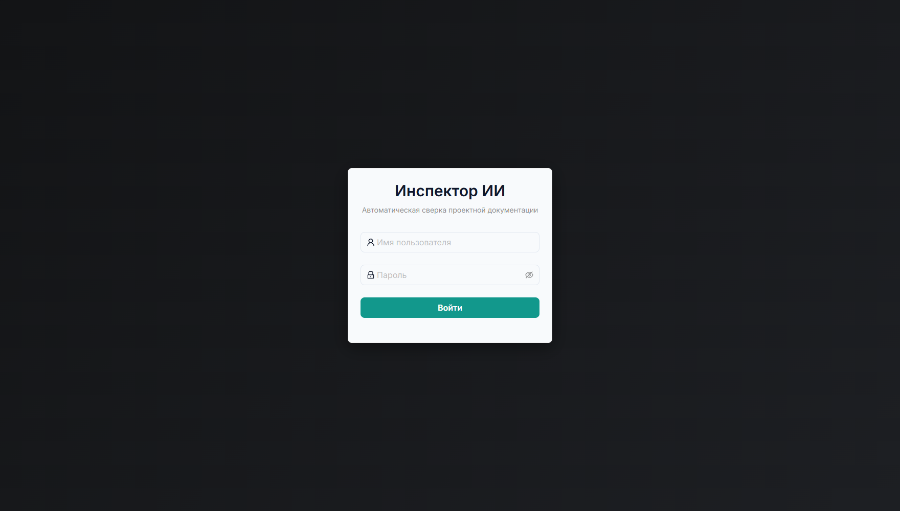

Рисунок 1. Окно входа

При первом входе на дашборде показывается инструкция для вашей роли: что делать на каждом экране
меню и в каком порядке.

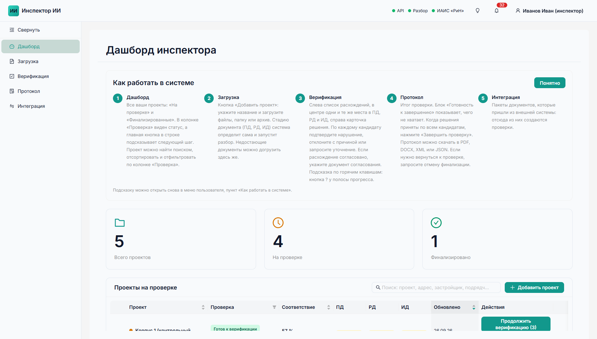

Рисунок 2. Инструкция для роли «Инспектор» на дашборде

> [!NOTE]
> Инструкцию можно открыть повторно: меню пользователя → **Как работать в системе**.

## 5 Дашборд

Дашборд открывается первым после входа. На нём видно состояние всех проектов и следующий шаг по
каждому.

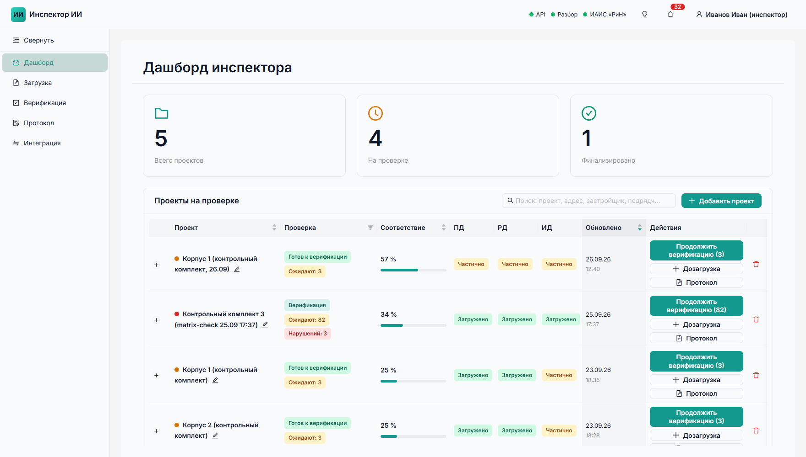

Рисунок 3. Дашборд инспектора

Таблица 4. Элементы дашборда

| Элемент | Содержимое |
|---|---|
| Карточки | Число проектов: всего, на проверке, финализировано. Щелчок по карточке открывает соответствующую таблицу. |
| Таблица проектов | Для каждого проекта: светофор и статус проверки; счётчики: ожидают решения, нарушений, уточнение; доля «Соответствие»; статус загрузки по стадиям ПД / РД / ИД; дата обновления. |
| Шапка | Состояние сервисов (API, разбор, обмен с ИАИС «РиН») и уведомления. |

**Действия со строкой проекта**

- **Главная кнопка** подсказывает следующий шаг, например **Продолжить верификацию (3)**.
- Кнопки **Дозагрузка** и **Протокол** расположены рядом с главной.
- Кнопка **+** раскрывает реквизиты проекта.

**Поиск, сортировка и фильтр**

- **Поиск** по названию, адресу, застройщику, подрядчику и разрешению.
- **Сортировка** по названию, соответствию и дате.
- **Фильтр** по статусу проверки.

## 6 Загрузка комплекта

1. Нажмите **Добавить проект** и заполните реквизиты: название, адрес, застройщик, подрядчик, номер
   разрешения.
2. Загрузите документы одним из способов:
   - файлами;
   - папкой: кнопка **Выбрать папку** или перетаскивание;
   - архивом `.zip`.
3. При необходимости приложите реестр комплекта в формате CSV, XLSX или JSON кнопкой
   **Выбрать реестр**.

**Результат:** система проверяет файлы, определяет стадию каждого и запускает разбор.

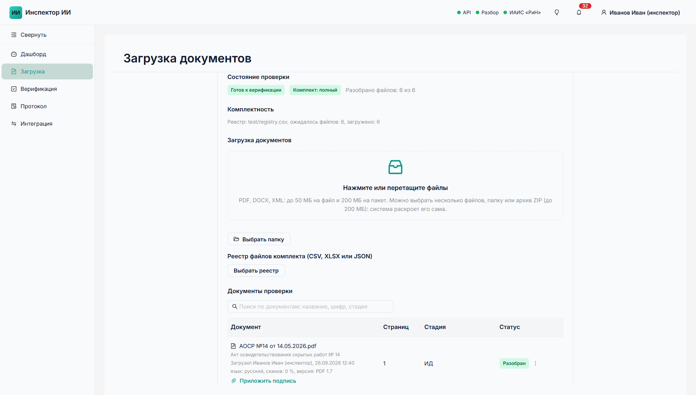

Рисунок 4. Загрузка документов

Таблица 5. Ограничения при загрузке

| Параметр | Значение |
|---|---|
| Форматы | PDF, DOCX, XML |
| Размер файла | до 50 МБ |
| Размер пакета | до 200 МБ |
| Основание | Требования ТЗ к загрузке через интерфейс |

> [!NOTE]
> Если комплект больше лимита, загрузите его частями через дозагрузку или воспользуйтесь серверным
> импортом.

**Как система определяет стадию файла**

Стадию указывать не нужно. Система определяет её сама по трём признакам:

- папка: **Проектная**, **Рабочая** или **Исполнительная документация**;
- реестр комплекта;
- шифр документа.

**Проверки при приёме**

Каждый файл проверяется на формат, размер, целостность PDF и дубликаты (по SHA-256). Отклонённый файл
остаётся в списке с указанием причины.

**Что отображается после загрузки**

- **Комплектность**, например «Реестр: ожидалось файлов 6, загружено 6».
- **Список документов**: стадия, число страниц, статус разбора, кто и когда загрузил, сведения о файле
  (язык, доля сканов, версия PDF), кнопка **Приложить подпись**.

## 7 Разбор и сравнение

> [!NOTE]
> Шаг выполняется автоматически, действий пользователя не требуется.

Анализ запускается сразу после загрузки. Статус на странице обновляется без перезагрузки. Анализ идёт
в два этапа:

1. **Разбор** каждого файла: текстовый слой, распознавание сканов, таблицы, штамп.
2. **Сравнение** по всем 132 параметрам матрицы.

Результаты разбора кешируются по SHA-256: тот же файл при повторной загрузке заново не разбирается.

**Время обработки.** Комплект 3 (48 документов, 132 параметра) проходит путь до готового протокола
примерно за 40 секунд.

## 8 Протокол

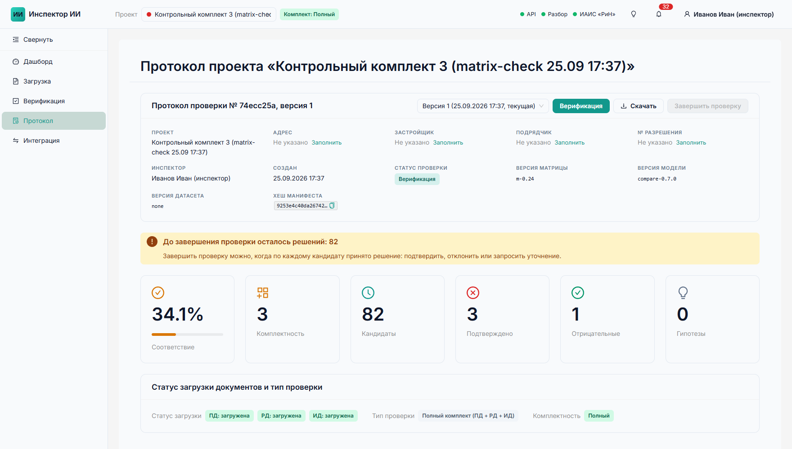

Рисунок 5. Шапка протокола и счётчики

**Шапка протокола**

Номер и версия протокола, объект, инспектор, дата, версии матрицы, движка и набора данных, хеш
манифеста. По этим данным протокол можно воспроизвести.

**Блоки под шапкой**

- **Готовность к завершению**: сколько решений осталось (например, «До завершения проверки осталось
  решений: 82») и что для этого нужно.
- **Счётчики**: соответствие, комплектность, кандидаты, подтверждённые, отрицательные (отклонённые
  инспектором), гипотезы.

Пояснение к каждому блоку открывается по значку ⓘ.

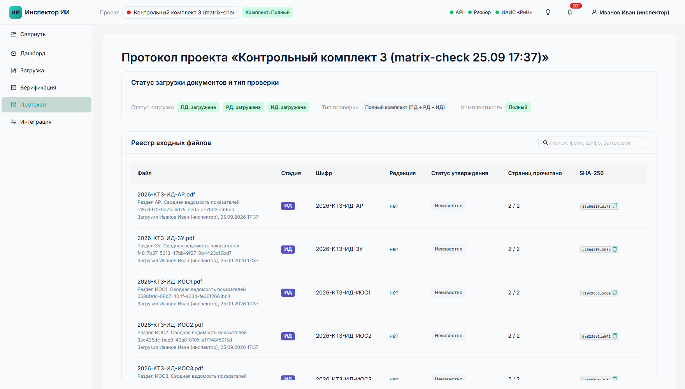

Рисунок 6. Статус загрузки и реестр входных файлов

**Нижняя часть протокола**

- **Статус загрузки** по стадиям и тип проверки (полный комплект ПД + РД + ИД).
- **Реестр входных файлов**: стадия, шифр, редакция, статус утверждения, прочитано страниц, SHA-256.
  В реестре есть поиск.
- **Пять таблиц протокола**: полнота, кандидаты, подтверждённые нарушения, отклонённые инспектором,
  гипотезы.

> [!NOTE]
> Каждая новая загрузка создаёт новую версию протокола. Предыдущие версии сохраняются в истории.

## 9 Центр верификации

В центре верификации инспектор просматривает кандидатов и доказательства к ним. Это основной рабочий
экран инспектора.

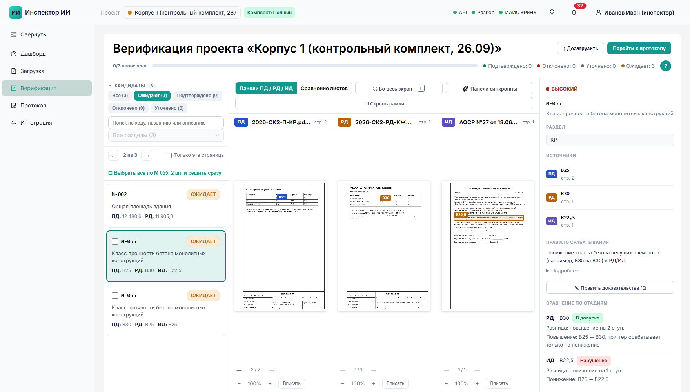

Рисунок 7. Центр верификации

Таблица 6. Области экрана

| Область | Содержимое |
|---|---|
| Слева: кандидаты | По умолчанию показаны «Ожидают решения». Фильтры по статусу и разделу матрицы, поиск, переход клавишами ← / →. |
| В центре: панели ПД / РД / ИД | Страницы документов с рамками доказательств. Синхронный масштаб и сдвиг, кнопка **Вписать**, переход к доказательству. |
| Справа: карточка | Приоритет, параметр и раздел, значения по стадиям со ссылкой на страницу, правило срабатывания из матрицы. |

> [!TIP]
> Справку по горячим клавишам открывает кнопка **?** у полосы прогресса.

### 9.1 Пример: сравнение по стадиям

Сравнение по стадиям объясняет вывод, а не только показывает числа. Пример взят из комплекта 1: класс
бетона плит перекрытия.

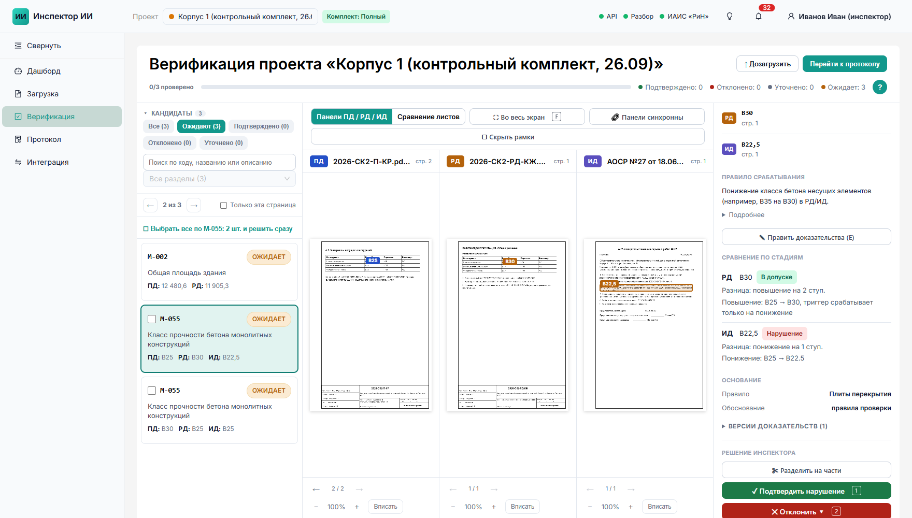

Рисунок 8. Сравнение значений по стадиям

Таблица 7. Класс бетона плит перекрытия (комплект 1)

| Стадия | Значение | Вывод системы | Почему |
|---|---|---|---|
| ПД | B25 | эталон | Исходное значение |
| РД | B30 | в допуске | Класс повышен, а триггер матрицы срабатывает только на понижение |
| ИД | B22,5 | нарушение | Понижение B25 → B22,5 |

В этом примере видна разница между «программа сравнила два значения» и «система понимает предмет».

## 10 Решение инспектора

Решение по кандидату принимается за 2–3 действия, в том числе с клавиатуры.

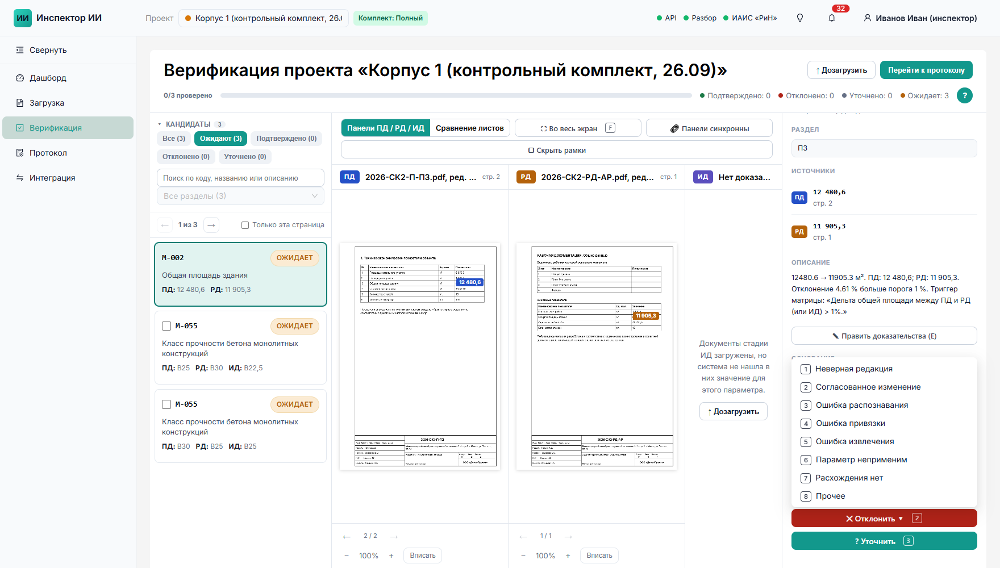

Рисунок 9. Карточка кандидата: выбор причины отклонения

Таблица 8. Варианты решения

| Клавиша | Решение | Что нужно указать |
|---|---|---|
| 1 | Подтвердить нарушение | Ничего, решение применяется сразу. |
| 2 | Отклонить | Причину (одну из восьми) и комментарий. Комментарий подставляется по шаблону причины. Для согласованного изменения нужна ссылка на документ согласования. |
| 3 | Уточнить | Комментарий. |

**Причины отклонения**

- неверная редакция;
- согласованное изменение;
- ошибка распознавания;
- ошибка привязки;
- ошибка извлечения;
- параметр неприменим;
- расхождения нет;
- прочее.

> [!NOTE]
> Каждое отклонение сохраняется как запись для дообучения.

**Дополнительные действия в карточке**

- **Править доказательства**: обвести область на листе вручную. Создаётся новая версия
  доказательства, машинная остаётся в истории.
- **Разделить на части**: разбить кандидата на несколько самостоятельных.
- **Выбрать все по параметру и решить сразу**: одно решение для всех кандидатов по параметру.

После решения экран автоматически переходит к следующему кандидату. Решение можно изменить до
завершения проверки.

## 11 Завершение проверки и выгрузка

**Условие:** решение принято по каждому кандидату. До этого кнопка **Завершить проверку** недоступна.

1. Нажмите **Завершить проверку**.

   **Результат:** протокол финализируется и передаётся во внешнюю систему надзора. Появляется плашка
   «Передано в ИАИС «РиН», квитанция …».

2. Выгрузите протокол в нужном формате: PDF, DOCX, XML, JSON или GOLD (формат эталонной разметки).

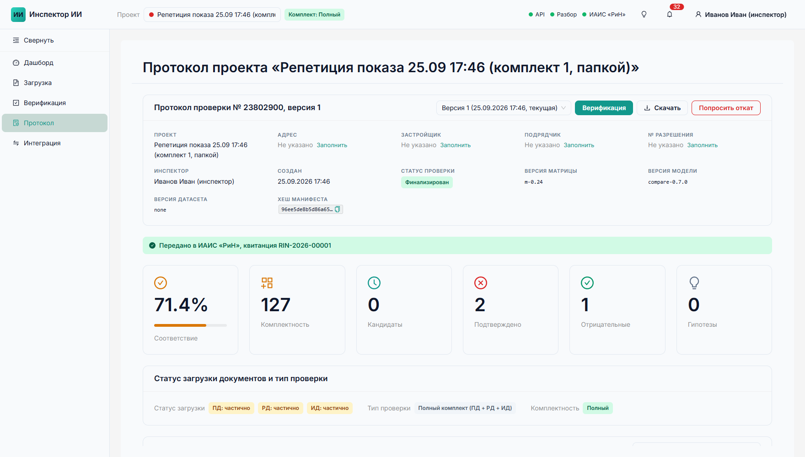

Рисунок 10. Финализированный протокол, переданный в ИАИС «РиН»

> [!NOTE]
> Если передача не удалась, система повторяет отправку автоматически. Чтобы отправить вручную,
> нажмите **Отправить повторно**.

## 12 Откат финализации

Отменить финализацию может только администратор или руководитель. Инспектор может только запросить
откат.

### 12.1 Запрос отката (инспектор)

1. Нажмите **Попросить откат**.
2. Укажите причину.

**Результат:** запрос уходит администратору и руководителю.

### 12.2 Обработка запроса (администратор или руководитель)

Запрос виден в уведомлениях (колокольчик) и первым блоком на дашборде «Инспекторы ждут вашего
решения». В блоке указаны проект, инспектор, причина и время запроса.

1. Найдите запрос в блоке «Инспекторы ждут вашего решения».
2. Нажмите **Откатить**, чтобы вернуть проверку в работу, или **Отклонить** и укажите причину.

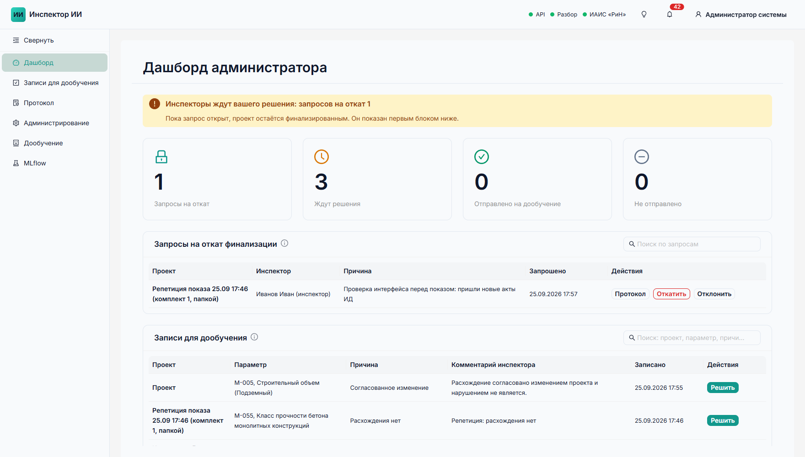

Рисунок 11. Запрос на откат на дашборде администратора

> [!NOTE]
> Все действия с откатом записываются в журнал аудита.

## 13 Работа администратора

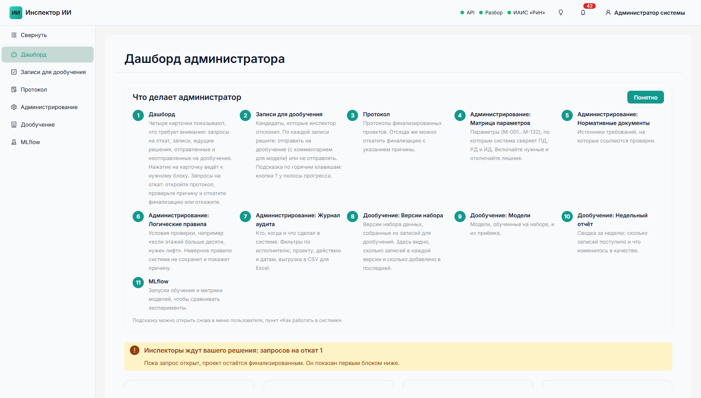

Рисунок 12. Дашборд администратора с инструкцией для роли

Таблица 9. Разделы администратора

| Раздел | Что в нём делают |
|---|---|
| Дашборд | Видят запросы на откат, записи, ждущие решения, отправленные и не отправленные на дообучение. |
| Записи для дообучения | Просматривают отклонённых инспектором кандидатов и решают по каждому: отправить в набор для дообучения (с комментарием для модели) или нет. |
| Администрирование | Матрица 132 параметров: включение, пороги, якоря, нормативные ссылки, история версий. Нормативная база. Логические правила. Журнал аудита: фильтры по исполнителю, проекту, действию и периоду, выгрузка в CSV. |
| Дообучение | Записи и версии набора GOLD; модели с проверками приёмки (одобрить, отклонить, откатить); недельный отчёт. |
| MLflow | Эксперименты: версии набора, модели с метриками, прогоны замеров качества. |

## 14 Что остаётся за человеком

Таблица 10. Действия, которые выполняет только человек

| Действие | Кто выполняет |
|---|---|
| Финальный статус «подтверждённое нарушение» | Только инспектор |
| Финализация проверки | Инспектор, действие записывается в журнал |
| Отмена финализации | Руководитель или администратор, с причиной и записью в журнал |
| Включение модели-скорера | Администратор после проверки метрик |
